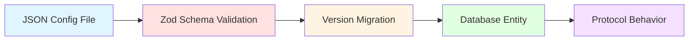

# Configuration Model

EUDIPLO's configuration model bridges the gap between human-readable JSON files and runtime protocol behavior. This page explains how configuration flows from JSON → validation → database → protocol execution, and how the import/export system ensures safe portability across environments.

---

## Overview

The configuration lifecycle follows this pipeline:



**Key Principles:**

- **JSON as source of truth**: Configuration is defined in JSON files, validated against Zod schemas, and stored in the database
- **Schema-driven validation**: Every configuration type has a versioned schema that enforces correctness before import
- **Safe portability**: Export never includes secrets or private keys; placeholders and regeneration policies ensure safe migration
- **Ownership model**: Resources can be `unmanaged` (editable via API/UI) or `file-managed` (authoritative from provisioning file)

---

## Configuration-to-Protocol Translation

EUDIPLO translates JSON configuration into protocol behavior at runtime:

| Configuration Layer | Protocol Layer | Example |
| --------------------- | ---------------- | --------- |
| **Credential Configuration** (`CredentialConfig`) | `credential_configurations_supported` in OID4VCI metadata | SD-JWT VC schema with selective disclosure fields |
| **Issuance Configuration** (`IssuanceConfig`) | Authorization server metadata, token endpoint behavior | DPoP enforcement, wallet attestation validation |
| **Presentation Configuration** (`PresentationConfig`) | OID4VP authorization request, DCQL query | Required credentials, trusted issuers, field constraints |
| **Key Chain** (`KeyChain`) | JWT/CWT signing, JWE encryption | ES256 signing key with X.509 certificate chain |
| **Trust List** (`TrustList`) | Trusted issuer validation | ETSI TL or OpenID Federation trust anchor |
| **Status List** (`StatusList`) | Revocation status lookup | OAuth Token Status List JWT |

**Runtime Example (Issuance):**

```text
1. JSON Config (IssuanceConfig)
   └─> { "dPopRequired": true, "walletAttestationRequired": true }

2. Validation (Zod Schema)
   └─> Ensures boolean types, validates authorization server structure

3. Database Entity (IssuanceConfig)
   └─> Stored as rows in `issuance_config` table, scoped by tenantId

4. Protocol Behavior (OID4VCI Token Endpoint)
   └─> Enforces DPoP proof validation and wallet attestation checks
```

---

## Configuration Import System

EUDIPLO supports importing configurations from JSON files on application startup. This feature allows you to pre-configure credentials, issuance workflows, and presentation verification rules without using the API.

### Startup Provisioning

Configuration files are loaded from the `config/` directory (or `assets/config/` when running locally with Node.js) when the application starts.

**Environment Variables:**

| Variable | Description | Default |
|----------|-------------|---------|
| `CONFIG_FOLDER` | Base directory for configuration files | `config/` (Docker), `assets/config/` (Node.js) |
| `CONFIG_IMPORT_MODE` | Import mode: `disabled`, `create`, `upsert`, `replace` | `disabled` |

**Import Modes:**

- **`disabled`**: No automatic import on startup (manual import via API only)
- **`create`**: Fail if a resource already exists (safe for initial bootstrap)
- **`upsert`**: Create missing resources and update existing resources
- **`replace`**: Upsert the bundle and delete only resources previously managed by the same bundle source but now absent (requires explicit confirmation)

:::warning[Replace Mode Safety]
`replace` mode never prunes unrelated unmanaged resources. It only removes resources that were previously provisioned by the same bundle and are now absent from the updated bundle.
:::

---

## Directory Structure

Configuration files are organized by tenant and resource type:

```text
config/
  ├── kms.json                          # Global KMS provider configuration
  ├── {tenantId}/
  │   ├── kms.json                      # Tenant-specific KMS overrides
  │   ├── key-chains/
  │   │   ├── attestation-key.json
  │   │   └── access-token-key.json
  │   ├── clients/
  │   │   └── wallet-client.json
  │   ├── issuance/
  │   │   ├── config.json               # Issuance configuration
  │   │   └── credentials/
  │   │       ├── diploma.json
  │   │       └── employee-badge.json
  │   ├── presentation/
  │   │   ├── age-verification.json
  │   │   └── employment-check.json
  │   ├── trust-lists/
  │   │   └── eu-wallet-providers.json
  │   ├── attribute-providers/
  │   │   └── hr-system.json
  │   └── webhook-endpoints/
  │       └── issuance-webhook.json
```

**Key Points:**

- **Tenant isolation**: Each tenant has its own folder (e.g., `tenant1`, `company-xyz`)
- **Configuration types**: Multiple configuration types are supported (credentials, issuance, presentation, key chains, etc.)
- **File naming**: Not strictly enforced; the `id` is taken from the JSON file content
- **Nested structure**: Credentials and issuance configs are grouped under `issuance/`

---

## Resource Envelope

Every portable resource uses a stable envelope structure:

```json
{
    "apiVersion": "eudiplo.io/presentation-config/v2",
    "kind": "PresentationConfig",
    "metadata": {
        "id": "age-check",
        "generation": 3,
        "ownership": "unmanaged"
    },
    "spec": {
        // Desired configuration only - no runtime state
    }
}
```

**Envelope Fields:**

| Field | Description |
| ------- | ------------- |
| `apiVersion` | Selects the portable schema and migration chain (e.g., `eudiplo.io/presentation-config/v2`) |
| `kind` | Resource type (e.g., `PresentationConfig`, `CredentialConfig`, `KeyChain`) |
| `metadata.id` | Stable identifier across instances |
| `metadata.generation` | Prevents an older file/bundle from overwriting newer configuration |
| `metadata.ownership` | `unmanaged` (editable via API/UI) or `file-managed` (authoritative from file) |
| `spec` | Desired configuration only (excludes runtime state, caches, sessions, timestamps) |

**Bare JSON Support:**

For backward compatibility, EUDIPLO accepts bare JSON (without the envelope). It detects the version, wraps it in an envelope, and runs the same migrations used by bundles.

---

## Bundle Layout

A ZIP export contains the following structure:

```text
bundle.zip
  ├── manifest.json                    # Bundle metadata, checksums, requirements
  ├── info.json                        # Export timestamp, source version, tenant
  ├── kms.json                         # KMS provider configuration
  ├── key-chains/
  │   ├── <id>.json
  │   └── ...
  ├── clients/
  │   └── <id>.json
  ├── issuance/
  │   ├── config.json
  │   └── credentials/
  │       └── <id>.json
  ├── presentation/
  │   └── <id>.json
  ├── attribute-providers/
  │   └── <id>.json
  ├── webhook-endpoints/
  │   └── <id>.json
  ├── trust-lists/
  │   └── <id>.json
  ├── images/
  │   └── <filename>
  └── ...
```

**`manifest.json` Contents:**

- Bundle format version
- Source EUDIPLO version
- Tenant ID
- Resource schema versions and generations
- Ownership status for each resource
- SHA-256 checksums for integrity
- Warnings and required inputs (e.g., missing private keys, secret placeholders)

**Binary Assets:**

Images and other binary assets are stored directly in the ZIP (in the `images/` directory) rather than embedded in resource JSON.

---

## Secret and Key Policy

Export is **safe by design** and never includes sensitive data:

| Resource Type | Export Behavior | Import Requirement |
| --------------- | ----------------- | --------------------- |
| **Retrievable passwords/tokens** | Replaced with `${ENV_NAME}` placeholders | Supply from target environment's secret manager |
| **Client secrets** | Not exported (only bcrypt hash is stored) | Replace placeholder with new secret or use `!generate` |
| **Database-held private keys** | Not included, reported as required input | Supply from target KMS or use `!regenerate` |
| **Non-exportable KMS keys** | Represented by provider ID, external key ID, and public JWK | Provider must have access to the same KMS key |
| **Runtime session/status data** | Never exported | N/A - not part of desired configuration |

**Secret Placeholder Syntax:**

```json
{
    "upstreamClientSecret": "${UPSTREAM_CLIENT_SECRET}"
}
```

**Client Secret Generation:**

For missing client secrets, set the placeholder to `!generate`:

```json
{
    "clientSecret": "!generate"
}
```

EUDIPLO will create a cryptographically random secret during apply and return it once in `generatedSecrets`. The UI offers an immediate download; the CLI prints the import result. The secret is never logged.

**Private Key Regeneration:**

For missing database-held private keys, replace `keySource.type: required` with `keySource.type: regenerate`:

```json
{
    "keySource": {
        "type": "regenerate",
        "provider": "vault",
        "keyChainType": "standalone"
    }
}
```

:::danger[Key Regeneration Warning]
Regeneration keeps the resource ID but changes its cryptographic identity. Only use this when issuing fresh key material and certificates is acceptable.
:::

---

## Import Pipeline

All imports (startup provisioning, API import, CLI import) use the same pipeline:

```mermaid
flowchart LR
    Decode[Decode ZIP/JSON] --> Verify[Verify Checksums]
    Verify --> Migrate[Migrate to Latest Version]
    Migrate --> Validate[Validate Against Schema]
    Validate --> Preflight[Preflight References & KMS]
    Preflight --> Plan[Produce Plan]
    Plan --> Apply[Apply in Dependency Order]
    Apply --> Record[Record Ownership]
    
    style Decode fill:#e1f5ff
    style Verify fill:#ffe1e1
    style Migrate fill:#fff4e1
    style Validate fill:#e1ffe1
    style Preflight fill:#f5e1ff
    style Plan fill:#e1f5ff
    style Apply fill:#ffe1e1
    style Record fill:#fff4e1
```



**Pipeline Stages:**

1. **Decode**: Parse ZIP or JSON input
2. **Verify Checksums**: Ensure bundle integrity (ZIP only)
3. **Migrate**: Run sequential config migrations to upgrade to latest schema version
4. **Validate**: Validate against the current Zod schema
5. **Preflight**: Verify references to other resources (e.g., key chains, webhook endpoints) and test KMS connectivity
6. **Plan**: Produce a read-only plan showing which resources will be created/updated/deleted
7. **Apply**: Execute the plan in dependency order (e.g., key chains before issuance configs)
8. **Record Ownership**: Mark resources as `file-managed` or `unmanaged`

**Plan-Before-Apply:**

Planning is **read-only** and reports each resource as:

- **`create`**: Resource does not exist and will be created
- **`update`**: Resource exists and will be updated
- **`delete`**: Resource exists but is absent from bundle (only in `replace` mode)
- **`blocked`**: Resource exists but is `file-managed` by a different source

Required human decisions (e.g., selecting trust-list verifier material, replacing a legacy inline webhook with a webhook endpoint reference) are **not guessed** by migrations. These must be resolved manually before import succeeds.

**KMS Preflight:**

External KMS references are preflighted by signing a challenge. When the bundle also replaces KMS configuration, this check is deferred until the new provider configuration has been applied.

---

## Environment Variable Placeholders

Secrets and environment-specific values can be injected at runtime using placeholders:

**Syntax:**

```json
{
    "vaultUrl": "${VAULT_URL}",
    "vaultToken": "${VAULT_TOKEN:default-token}"
}
```

**Resolution:**

- `${VAR_NAME}`: Required environment variable (fails if not set)
- `${VAR_NAME:default}`: Optional environment variable with default value

**When to Use:**

- **Development**: Use defaults for local testing
- **Production**: Use actual environment variables for secrets

**Example (KMS Configuration):**

```json
{
    "defaultProvider": "vault",
    "providers": [
        {
            "id": "vault",
            "type": "vault",
            "vaultUrl": "${VAULT_URL}",
            "vaultToken": "${VAULT_TOKEN}"
        }
    ]
}
```

---

## Ownership Model

Resources are either **unmanaged** or **file-managed**:

| Ownership | API/UI Edits | Re-import Behavior | Use Case |
| ----------- | -------------- | --------------------- | ---------- |
| **`unmanaged`** | ✅ Allowed | Imports succeed but do not prevent manual edits | Development, ad-hoc testing |
| **`file-managed`** | ❌ Rejected with conflict | Re-importing is idempotent; file is authoritative | Production, CI/CD, GitOps |

**Lifecycle:**

1. **Import**: Resource is created with ownership set to `file-managed`
2. **Re-Import**: Updates are idempotent; the file remains authoritative
3. **API/UI Edit Attempt**: Rejected with HTTP 409 Conflict
4. **Detach**: Explicitly change ownership to `unmanaged` (does not delete or alter the resource)
5. **API/UI Edit**: Now allowed

**Preventing Last-Writer-Wins:**

This model avoids silent last-writer-wins behavior when an operator edits a resource in the UI while a deployment continues to provision an older file.

**Web Client Indicators:**

The web client shows a managed-resource notice with the provisioning source and generation on configuration detail and edit screens. Mutation controls are disabled there, while **Settings > Configuration Portability** provides the complete ownership table and the explicit detach action.

---

## Management API

The configuration portability API exposes:

| Endpoint | Method | Purpose |
| ---------- | -------- | --------- |
| `/api/config-bundles/export?format=zip` | GET | Export a tenant archive |
| `/api/config-bundles/plan/archive?mode=upsert` | POST | Validate and plan a ZIP import |
| `/api/config-bundles/import/archive?mode=upsert` | POST | Apply a planned ZIP import |
| `/api/config-bundles/documents/upgrade` | POST | Upgrade one resource envelope |
| `/api/config-bundles/resources` | GET | List ownership and generations |
| `/api/config-bundles/resources/:kind/:id/detach` | POST | Detach a managed resource |

**Import Parameters:**

- `mode`: `create`, `upsert`, or `replace`
- `confirmReplace=true`: Required for `replace` mode (safety check)

**Bundle Format:**

- **ZIP**: Multipart field named `bundle`
- **JSON**: JSON body (for single-resource or JSON bundle variants)

**Audit:**

Exports, imports, and detach operations are recorded in the tenant audit log.

---

## Configuration Types

### Key Chains

**Location**: `config/{tenant}/key-chains/*.json`

Import unified key chains that combine cryptographic keys and their certificates.

**Example (Standalone - Self-Signed):**

```json
{
    "id": "attestation-key",
    "description": "Attestation signing key chain",
    "usageType": "attestation",
    "key": {
        "kty": "EC",
        "x": "pmn8SKQKZ0t2zFlrUXzJaJwwQ0WnQxcSYoS_D6ZSGho",
        "y": "rMd9JTAovcOI_OvOXWCWZ1yVZieVYK2UgvB2IPuSk2o",
        "crv": "P-256",
        "d": "rqv47L1jWkbFAGMCK8TORQ1FknBUYGY6OLU1dYHNDqU",
        "alg": "ES256"
    }
}
```

**Example (With Rotation - Internal CA):**

```json
{
    "id": "attestation-key",
    "description": "HAIP-compliant attestation key chain",
    "usageType": "attestation",
    "key": {
        "kty": "EC",
        "x": "...",
        "y": "...",
        "crv": "P-256",
        "d": "...",
        "alg": "ES256"
    },
    "rotationPolicy": {
        "enabled": true,
        "intervalDays": 90,
        "certValidityDays": 365
    }
}
```

When `rotationPolicy.enabled` is `true`:

- The imported key becomes the **root CA key**
- A new **leaf signing key** is automatically generated
- The leaf certificate is signed by the imported CA key
- Supports automatic key rotation

**Example (With Provided Certificate):**

```json
{
    "id": "attestation-key",
    "description": "Key chain with external certificate",
    "usageType": "access",
    "key": { "kty": "EC", "..." },
    "crt": [
        "-----BEGIN CERTIFICATE-----\nLEAF_CERT...\n-----END CERTIFICATE-----",
        "-----BEGIN CERTIFICATE-----\nCA_CERT...\n-----END CERTIFICATE-----"
    ]
}
```

**Usage Types:**

| Usage Type | Purpose |
| ------------ | --------- |
| `access` | OAuth/OIDC access token signing and authentication |
| `attestation` | Credential/attestation signing (SD-JWT VC, mDOC) |
| `trustList` | Trust list signing |
| `statusList` | Status list (credential revocation) signing |
| `encrypt` | Encryption (JWE) |

**Schema Reference**: [Key Chain Import DTO](https://github.com/openwallet-foundation/eudiplo/blob/main/schemas/KeyChainImportDto.schema.json)

---

### Credential Configurations

**Location**: `config/{tenant}/issuance/credentials/*.json`

Define credential templates and schemas.

**Example:**

```json
{
    "id": "university-diploma",
    "description": "University Diploma Credential",
    "config": {
        "format": "dc+sd-jwt",
        "display": [{
            "name": "University Diploma",
            "locale": "en-US",
            "background_color": "#12107c",
            "text_color": "#FFFFFF"
        }],
        "scope": "diploma"
    },
    "fields": [
        {
            "path": ["credentialSubject", "firstName"],
            "type": "string",
            "display": [{ "name": "First Name", "locale": "en-US" }]
        },
        {
            "path": ["credentialSubject", "degree"],
            "type": "string",
            "display": [{ "name": "Degree", "locale": "en-US" }],
            "mandatory": true
        }
    ]
}
```

**Schema Reference**: See [Credential Configuration API](../reference/openapi.md).

---

### Issuance Configurations

**Location**: `config/{tenant}/issuance/issuance/*.json`

Define issuance workflows and authentication requirements.

**Example:**

```json
{
    "batchSize": 1,
    "dPopRequired": true,
    "walletAttestationRequired": true,
    "authorizationServers": [
        {
            "type": "built-in",
            "id": "default",
            "credentialConfigurationIds": ["university-diploma"]
        }
    ]
}
```

**Schema Reference**: See [Issuance Configuration API](../reference/openapi.md).

---

### Presentation Configurations

**Location**: `config/{tenant}/presentation/*.json`

Define verification requirements for credential presentations.

**Example:**

```json
{
    "id": "age-verification",
    "description": "Verify user is over 18",
    "credentialQuery": {
        "credential_sets": [[{
            "format": "dc+sd-jwt",
            "meta": { "vct_values": ["urn:eu:age-over-18"] },
            "claims": [{ "path": ["age"], "values": ["18+"] }]
        }]]
    },
    "trustedAuthorities": [{
        "type": "etsi_tl",
        "values": [{ "trustListId": "eu-wallet-providers" }]
    }]
}
```

**Schema Reference**: See [Presentation Configuration API](../reference/openapi.md).

---

### Trust List Configurations

**Location**: `config/{tenant}/trust-lists/*.json`

Define trust lists for credential verification. Trust lists specify which issuers and revocation services are trusted when verifying credentials during presentation flows.

---

## Next Steps

- **Import Configuration**: [Startup Provisioning](../deployment/environment-variables.md)
- **Export/Bundle**: [API Reference](../reference/openapi.md)
- **Core Concepts**: [Entities and Relationships](./core-concepts.md)
- **Issuance**: [Issuance Architecture](./issuance.md)
- **Presentation**: [Presentation Architecture](./presentation.md)
