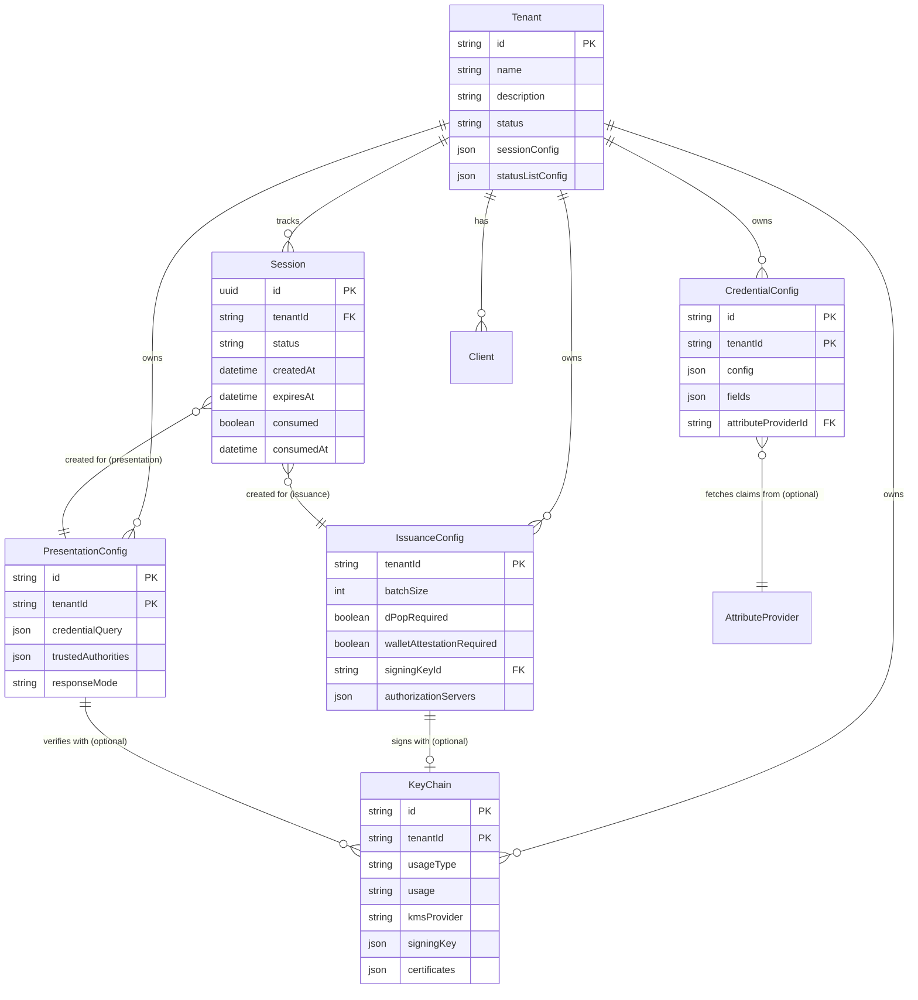
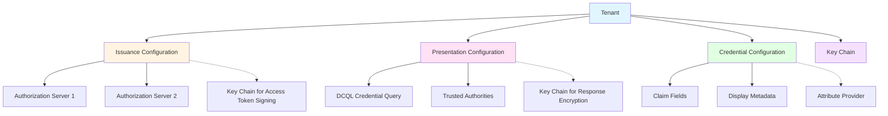

# Core Concepts

EUDIPLO's architecture is built around a small set of core entities that work together to enable credential issuance and presentation. Understanding these concepts and their relationships is essential for configuring and using the system effectively.

---

## Entities and Their Relationships

The following diagram shows the core entities and how they relate to each other:

---

## Core Entities

### Tenant

A **Tenant** represents an isolated configuration space for a single organization or environment. All other entities are scoped to a tenant via the `tenantId` column.

**Key Properties:**

- **Multi-tenancy isolation**: Each tenant has its own credentials, keys, and sessions
- **Session cleanup configuration**: Controls TTL and cleanup mode (`full` or `anonymize`)
- **Status list configuration**: Controls the size and bits per entry for newly created status lists

**Usage:** See [Tenant Management](../administration/tenants.md) for operational details.

---

### Credential Configuration

A **Credential Configuration** defines the structure, display properties, and metadata for a specific credential type (e.g., "University Diploma", "Employee Badge").

**Key Properties:**

- **Format**: Credential format (`mso_mdoc` for ISO mDOC, `dc+sd-jwt` for SD-JWT VC)
- **Fields**: Array of claim definitions with paths, types, and disclosure policies
- **Display metadata**: Localized name, description, colors, logo, and background images
- **Attribute provider**: Optional reference to an external system that supplies claim values

**Relationship to Issuance:**

- A credential configuration is referenced by an issuance session when creating a credential offer
- Multiple credential configurations can be issued through the same issuance configuration

**Usage:** See [Credential Configuration](../issuance/credential-configuration.md).

---

### Issuance Configuration

An **Issuance Configuration** defines _how_ credentials are issued: which authorization servers to use, batch size, proof requirements, and wallet attestation policies.

**Key Properties:**

- **Authorization servers**: One or more AS configurations (built-in, external, chained, or OID4VP-based)
- **DPoP requirement**: Whether wallets must prove possession of their keys
- **Wallet attestation**: Whether to require and validate wallet provider attestations
- **Signing key**: Optional reference to a specific `KeyChain` for signing access tokens

**Relationship to Credential Configuration:**

- An issuance configuration does not directly reference credential configurations
- The wallet includes the desired `credential_configuration_id` in its request
- EUDIPLO validates that the credential configuration exists and is accessible to the tenant

**Usage:** See [Issuance Configuration](../issuance/issuance-configuration.md).

---

### Presentation Configuration

A **Presentation Configuration** defines _what_ credentials a verifier requires and _how_ to validate them.

**Key Properties:**

- **Credential query**: DCQL query specifying required credential formats, fields, and values
- **Trusted authorities**: Trust lists or federation roots used to validate credential issuers
- **Response mode**: How the wallet submits the presentation (`direct_post.jwt`)
- **Webhook endpoint**: Where to send the verification result after validation

**Relationship to KeyChain:**

- May reference a `KeyChain` for encrypting the authorization response (JWE)
- May reference trust list `KeyChain` entities to verify issuer signatures

**Usage:** See [Presentation Configuration](../presentation/index.md).

---

### Key Chain

A **Key Chain** is a unified entity that combines cryptographic keys and their certificates. It supports both standalone keys (self-signed) and internal certificate chains (root CA + leaf signing key).

**Key Properties:**

- **Usage type**: `access`, `attestation`, `trustList`, `statusList`, or `encrypt`
- **KMS provider**: Where the key material is stored (`db`, `vault`, `aws-kms`, `pkcs11`, etc.)
- **Certificate chain**: Optional X.509 certificates (leaf first, then intermediates/root)
- **Rotation policy**: Optional automatic rotation for internal CA chains

**Algorithms:**

- Primary algorithm: **ES256** (ECDSA with P-256 curve)
- Used for signing access tokens, credentials, trust lists, and status lists

**Relationship to Other Entities:**

- **Issuance Configuration**: References a `KeyChain` via `signingKeyId` for signing access tokens
- **Presentation Configuration**: References `KeyChain` entities in trust list configurations for verifying credential issuers

**Usage:** See [Key Chains](../trust/key-chains.md) and [Key Management](./cryptography.md).

---

### Session

A **Session** tracks the state of a single issuance or presentation flow. It stores protocol-specific data, user identity, credentials, and transaction state.

**Key Properties:**

- **Status**: `active`, `fetched`, `completed`, `expired`, or `failed`
- **Single-use enforcement**: Sessions are marked `consumed` after first use to prevent replay attacks
- **Cleanup modes**: Sessions can be fully deleted or anonymized (keep metadata, remove personal data)
- **Security fields** (OID4VP only): `walletNonce` and `responseCode` implement the OID4VP §13.3 security model

**Lifecycle:**

1. **Created** when a credential offer or presentation request is generated
2. **Updated** as the wallet progresses through authorization, token exchange, and credential/presentation submission
3. **Consumed** when the flow completes (credential issued or presentation verified)
4. **Cleaned up** based on tenant-specific TTL and cleanup mode

**Usage:** See [Session Management](./sessions.md).

---

## Configuration Hierarchy

The configuration model follows a hierarchical structure:

**Key Points:**

- All entities are tenant-scoped (isolated by `tenantId`)
- Issuance and presentation configurations reference key chains but not credential configurations
- Credential configurations can optionally reference attribute providers for dynamic claim fetching
- Sessions are created per flow and reference either an issuance or presentation configuration

---

## Runtime Flow: Issuance

When issuing a credential:

1. **Offer Creation**: EUDIPLO creates a credential offer and a new `Session` (status: `active`)
2. **Authorization**: The wallet authenticates via one of the configured authorization servers
3. **Token Exchange**: The wallet exchanges the authorization code for an access token (signed by the referenced `KeyChain`)
4. **Credential Request**: The wallet requests a credential, referencing the `credential_configuration_id`
5. **Signing**: EUDIPLO signs the credential using the attestation `KeyChain` associated with the credential configuration
6. **Session Update**: The session is marked `consumed` and status becomes `completed`

See [Issuance Architecture](./issuance.md) for protocol-level details.

---

## Runtime Flow: Presentation

When verifying a credential:

1. **Request Creation**: EUDIPLO creates a presentation request and a new `Session` (status: `active`)
2. **Wallet Response**: The wallet submits a VP Token (encrypted as JWE if configured)
3. **Verification**: EUDIPLO verifies the credential signature against the trusted authorities in the `PresentationConfig`
4. **Trust Validation**: If trust lists are configured, EUDIPLO verifies the issuer is in the trust list (validated via the trust list `KeyChain`)
5. **Session Update**: The session is marked `consumed` and status becomes `completed`
6. **Webhook Notification**: The verification result is sent to the configured webhook endpoint

See [Presentation Architecture](./presentation.md) for protocol-level details.

---

## Next Steps

- **Tenant Management**: [Tenant Administration](../administration/tenants.md)
- **Configuration Model**: [Configuration Import and Portability](./configuration-model.md)
- **Issuance Flow**: [Issuance Architecture](./issuance.md)
- **Presentation Flow**: [Presentation Architecture](./presentation.md)
- **Key Management**: [Cryptography](./cryptography.md)
- **Session Lifecycle**: [Session Management](./sessions.md)
