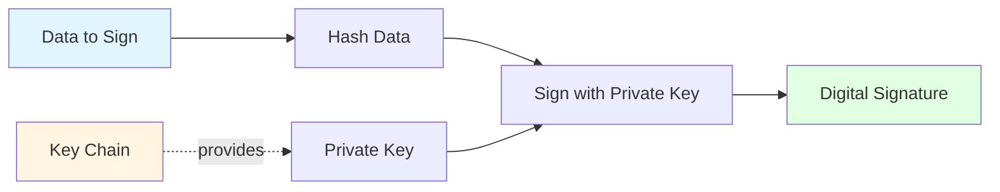
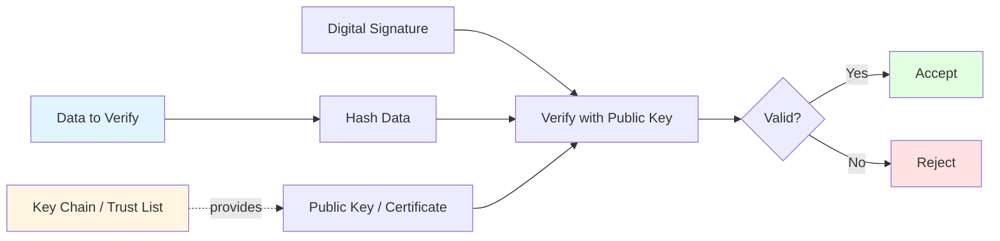
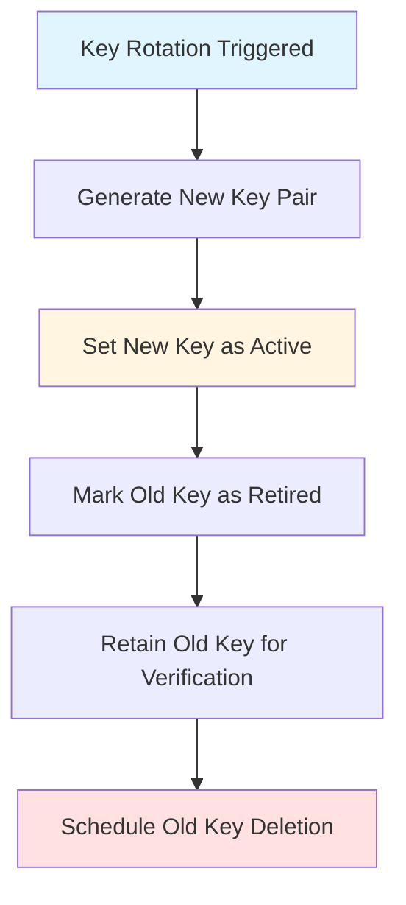

# Cryptography

This page provides a concise overview of EUDIPLO's cryptographic operations, algorithms, and the relationship between **Key Chains** and signing/verification workflows.

---

## Overview

EUDIPLO uses **Key Chains** to manage cryptographic key material for signing and verification operations across all protocols (OID4VCI, OID4VP, status lists, trust lists).

**Key Chain:** A logical grouping of cryptographic keys with metadata (algorithm, usage, rotation policy, KMS provider). Each key chain represents a **single purpose** (e.g., credential signing, access token signing, status list signing).

---

## Supported Algorithms

EUDIPLO supports the following cryptographic algorithms:

| Algorithm | Type | Curve/Key Size | Use Case | Status |
| ----------- | ------ | ---------------- | ---------- | -------- |
| **ES256** | ECDSA | P-256 (secp256r1) | Credential signing, access tokens, status lists, trust lists | ✅ **Primary** |
| **ES384** | ECDSA | P-384 (secp384r1) | High-security environments | ⚠️ Experimental |
| **ES512** | ECDSA | P-521 (secp521r1) | High-security environments | ⚠️ Experimental |
| **RS256** | RSA-PSS | 2048-bit | Legacy interoperability | ⚠️ Supported |
| **EdDSA** | Edwards-curve | Ed25519 | Future EUDI ARF support | 🔮 Planned |

**Recommendation:** Use **ES256** for all production deployments. This is the **EUDI Wallet ARF baseline requirement** and ensures maximum interoperability across EUDI ecosystem implementations.

---

## Hashing and Signing

### Signing Operations

All signing operations follow a consistent pattern:



**Steps:**

1. **Hash the data**: Compute SHA-256 hash of the data (for ES256)
2. **Retrieve private key**: Load private key from the configured KMS provider
3. **Sign the hash**: Use ECDSA to sign the hash
4. **Encode signature**: Encode signature as Base64URL (for JWT) or CBOR (for mDOC/CWT)

---

### Verification Operations

Signature verification follows the inverse pattern:



**Steps:**

1. **Hash the data**: Compute SHA-256 hash of the data
2. **Retrieve public key**: Extract public key from JWT header (`x5c` or JWKS) or trust list
3. **Verify the signature**: Use ECDSA to verify the signature against the hash
4. **Accept or reject**: Proceed if valid; reject if invalid

---

## Key Chain Usage Modes

Each Key Chain has a **usage mode** that determines its purpose:

| Usage Mode | Purpose | Example Operations |
| ------------ | --------- | ------------------- |
| `access` | Access token signing | Sign OID4VCI access tokens |
| `attestation` | Credential signing | Sign SD-JWT VCs and mDOCs |
| `statusList` | Status list signing | Sign OAuth Token Status Lists |
| `trustList` | Trust list signing | Sign ETSI TL or OpenID Federation metadata |
| `encrypt` | Response encryption | Decrypt JWE-encrypted VP Tokens |

**Example:** A tenant might have three key chains:

```json
[
    { "id": "access-key", "usage": "access", "algorithm": "ES256" },
    { "id": "attestation-key", "usage": "attestation", "algorithm": "ES256" },
    { "id": "status-key", "usage": "statusList", "algorithm": "ES256" }
]
```

---

## Key Chain and Protocol Mapping

| Protocol Operation | Key Chain Usage | Algorithm | Signing Entity | Verifying Entity |
| -------------------- | ----------------- | ----------- | ---------------- | ------------------ |
| **Issue Access Token** | `access` | ES256 | EUDIPLO (Authorization Server) | Wallet (via JWKS) |
| **Issue SD-JWT VC** | `attestation` | ES256 | EUDIPLO (Issuer) | Verifier (via `x5c` or federation) |
| **Issue mDOC** | `attestation` | ES256 | EUDIPLO (Issuer) | Verifier (via certificate chain) |
| **Sign Status List** | `statusList` | ES256 | EUDIPLO (Issuer) | Verifier (via JWKS) |
| **Sign Trust List** | `trustList` | ES256 | Trust Anchor | EUDIPLO (Verifier) |
| **Decrypt VP Token** | `encrypt` | ECDH-ES+A256KW | EUDIPLO (Verifier) | Wallet (encrypts to EUDIPLO's public key) |

---

## Key Material Formats

### JWK (JSON Web Key)

EUDIPLO stores and transports public keys using the **JWK (JSON Web Key)** format:

**ES256 Public Key (JWK):**

```json
{
    "kty": "EC",
    "crv": "P-256",
    "x": "f83OJ3D2xF1Bg8vub9tLe1gHMzV76e8Tus9uPHvRVEU",
    "y": "x_FEzRu9m36HLN_tue659LNpXW6pCyStikYjKIWI5a0",
    "use": "sig",
    "alg": "ES256"
}
```

**Private Key (JWK):**

Private keys include the `d` parameter (the private exponent). **EUDIPLO never exports or logs private key JWKs**.

```json
{
    "kty": "EC",
    "crv": "P-256",
    "x": "f83OJ3D2xF1Bg8vub9tLe1gHMzV76e8Tus9uPHvRVEU",
    "y": "x_FEzRu9m36HLN_tue659LNpXW6pCyStikYjKIWI5a0",
    "d": "jpsQnnGQmL-YBIffH1136cspYG6-0iY7X1fCE9-E9LI"
}
```

---

### X.509 Certificates

For **X.509-based trust models** (ETSI TL, mDOC), EUDIPLO supports certificate chains:

**Certificate Chain Structure:**

```json
{
    "x5c": [
        "MIICmzCCAYOgAwIBAgIBADANBgkqhkiG9w0BAQsFADA...",
        "MIIDXTCCAkWgAwIBAgIJAJC1HiIAZAiIMA0GCSqGSIb3...",
        "MIIDdzCCAl+gAwIBAgIBADANBgkqhkiG9w0BAQsFADB..."
    ]
}
```

**Order:**

1. Leaf certificate (issuer's signing certificate)
2. Intermediate CA certificates
3. Root CA certificate (optional)

**Verification:**

EUDIPLO verifies the certificate chain by:

1. Verifying each certificate's signature using the next certificate in the chain
2. Checking certificate validity dates (`notBefore`, `notAfter`)
3. Checking certificate revocation status (if CRL or OCSP is configured)
4. Verifying the root CA is trusted (via trust list or trust store)

---

## Key Rotation

Key Chains support **automatic key rotation** to enhance security and comply with key lifecycle policies.

### Rotation Policy

A rotation policy specifies **when** and **how often** to rotate keys:

```json
{
    "enabled": true,
    "rotateAfterDays": 90,
    "retainOldKeyDays": 180
}
```

| Field | Description |
| ------- | ------------- |
| `enabled` | Whether rotation is enabled |
| `rotateAfterDays` | Rotate key after this many days |
| `retainOldKeyDays` | Keep old key for verification (for issued credentials) |

**Rotation Flow:**



**Steps:**

1. **Generate new key pair**: Create a new key via the configured KMS provider
2. **Activate new key**: Update the key chain to use the new key for signing
3. **Retire old key**: Mark the old key as retired (no longer used for signing)
4. **Retain old key**: Keep the old key for verification (to validate previously issued credentials)
5. **Schedule deletion**: After `retainOldKeyDays`, permanently delete the old key

**Benefits:**

- Limits the impact of key compromise (old credentials remain verifiable)
- Complies with key lifecycle policies (e.g., FIPS 140-2)
- Supports gradual migration to new keys

---

## Key Derivation and Thumbprints

### Key Thumbprint (JKT)

For DPoP (Demonstrating Proof-of-Possession), EUDIPLO computes the **JWK Thumbprint (JKT)** of the wallet's public key:

**Formula:**

```text
jkt = Base64URL(SHA-256(UTF8(JWK_CANONICAL)))
```

**Canonical JWK:**

The canonical JWK is a JSON object with keys sorted alphabetically:

```json
{"crv":"P-256","kty":"EC","x":"f83OJ3D2xF1Bg8vub9tLe1gHMzV76e8Tus9uPHvRVEU","y":"x_FEzRu9m36HLN_tue659LNpXW6pCyStikYjKIWI5a0"}
```

**Use Case:**

The JKT is embedded in the access token (`cnf.jkt`) to bind the token to the wallet's key.

---

## Encryption (JWE)

EUDIPLO uses **JWE (JSON Web Encryption)** to encrypt VP Tokens in OID4VP flows.

### Encryption Algorithm

| Algorithm | Purpose | Key Agreement | Content Encryption |
|-----------|---------|---------------|-------------------|
| **ECDH-ES+A256KW** | VP Token encryption | ECDH (P-256) | AES-256-KW |

**Flow:**

1. Wallet fetches verifier's public key (from presentation request metadata)
2. Wallet generates ephemeral key pair
3. Wallet computes shared secret via ECDH
4. Wallet derives content encryption key (CEK) via HKDF
5. Wallet encrypts VP Token using AES-256-GCM
6. Wallet wraps CEK using AES-256-KW
7. Wallet sends JWE to EUDIPLO

**JWE Structure:**

```text
<Base64URL(JWE Protected Header)>.<Base64URL(Encrypted Key)>.<Base64URL(IV)>.<Base64URL(Ciphertext)>.<Base64URL(Authentication Tag)>
```

**Decryption:**

EUDIPLO decrypts the JWE using the configured encryption key chain (usage: `encrypt`).

---

## Key Storage and Security

### Database-Stored Keys (`db` Provider)

Keys stored in the database are **encrypted at rest** using AES-256-GCM:

| Field | Encryption | Notes |
| ------- | ------------ | ------- |
| **Private Key (JWK)** | ✅ Encrypted | Encrypted using a master key derived from `DB_ENCRYPTION_KEY` |
| **Public Key (JWK)** | ❌ Plaintext | Public keys are not sensitive |
| **Certificate (X.509)** | ❌ Plaintext | Certificates are public material |

**Master Key Derivation:**

The master key is derived from the `DB_ENCRYPTION_KEY` environment variable using PBKDF2:

```typescript
const masterKey = pbkdf2Sync(
    process.env.DB_ENCRYPTION_KEY,
    'eudiplo-salt',
    100000, // iterations
    32, // key length (bytes)
    'sha256'
);
```

---

### External KMS Providers

For production deployments, use an external KMS provider to store private keys:

| Provider | Security Model |
| ---------- | --------------- |
| **HashiCorp Vault** | Keys stored in Vault Transit secrets engine (never leave Vault) |
| **AWS KMS** | Keys stored in AWS HSM (FIPS 140-2 Level 2) |
| **PKCS#11 HSM** | Keys stored in hardware security module (FIPS 140-2 Level 3+) |

**Signing Flow (External KMS):**

1. EUDIPLO sends data to be signed to the KMS provider
2. KMS provider signs the data using the private key
3. KMS provider returns the signature
4. EUDIPLO includes the signature in the JWT/CWT

**Benefits:**

- Private keys **never leave the KMS** (even for signing operations)
- FIPS 140-2 compliance
- Centralized key lifecycle management
- Audit logging of all key operations

---

## Certificate Trust and Validation

For X.509-based trust models (mDOC, ETSI TL), EUDIPLO validates certificates using:

### Certificate Validation Checks

| Check | Description |
| ------- | ------------- |
| **Signature Verification** | Verify certificate is signed by the issuing CA |
| **Validity Dates** | Verify `notBefore <= now <= notAfter` |
| **Trust Anchor** | Verify root CA is in the configured trust list |
| **Revocation Status** | Check CRL or OCSP (if configured) |
| **Key Usage** | Verify certificate is authorized for the operation (e.g., `digitalSignature`) |
| **Extended Key Usage** | Verify certificate EKU matches the use case (e.g., `id-kp-codeSigning`) |

**Trust List Configuration:**

Trust lists are configured per presentation configuration:

```json
{
    "trustedAuthorities": [
        {
            "type": "etsi_tl",
            "uri": "https://trust.example.com/tl.jwt",
            "verifierKey": { "kty": "EC", "crv": "P-256", "x": "...", "y": "..." }
        }
    ]
}
```

---

## Next Steps

- **Key Management**: [KMS Providers and Configuration](../administration/kms.md)
- **Key Chain Management**: [Key Chain API](../trust/key-chains.md)
- **Security Architecture**: [Token Validation and DPoP](./security.md)
- **Trust Lists**: [Trust List Management](../trust/trust-lists.md)
- **Status Lists**: [Revocation and Suspension](../issuance/status-management.md)
