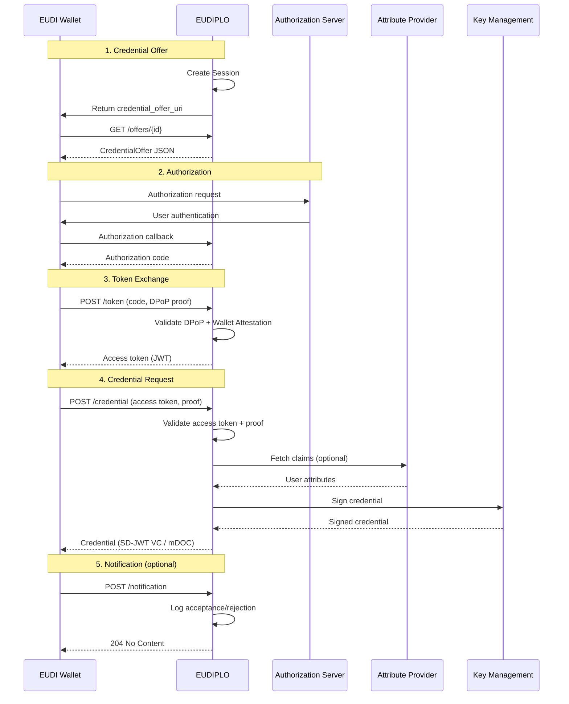
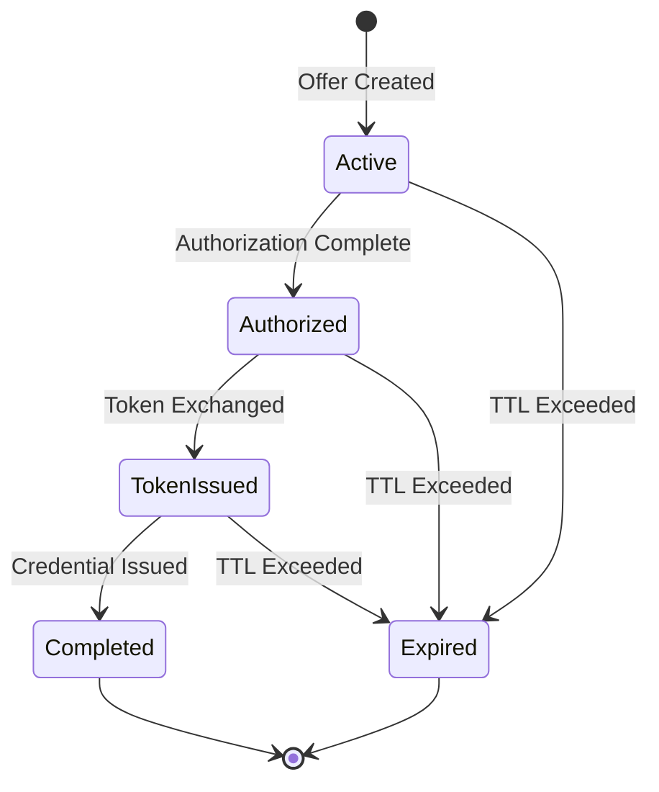

# Issuance Architecture

This page provides an architecture-level overview of how EUDIPLO implements the **OpenID for Verifiable Credential Issuance (OID4VCI)** protocol. For usage-level documentation and configuration examples, see [Issuance Configuration](../issuance/index.md).

---

## Overview

EUDIPLO implements OID4VCI to enable credential issuance to EUDI Wallets. The issuance flow follows the OAuth 2.0-based protocol with credential-specific extensions:

1. **Credential Offer**: EUDIPLO creates an offer containing metadata about available credentials
2. **Authorization**: The wallet authenticates the user (via one of the configured authorization servers)
3. **Token Exchange**: The wallet exchanges an authorization code for an access token
4. **Credential Request**: The wallet requests one or more credentials using the access token
5. **Notification** *(optional)*: The wallet notifies EUDIPLO whether the credential was accepted or rejected

---

## Issuance Flow Diagram



---

## Module Structure

The issuance architecture is organized into several modules within `apps/backend/src/issuer`:

```text
issuer/
  ├── configuration/         # Configuration entities and services
  │   ├── credentials/       # Credential configuration (schema, display, fields)
  │   ├── issuance/          # Issuance configuration (AS, DPoP, batch size)
  │   ├── attribute-provider/# External claim sources
  │   └── webhook-endpoint/  # Notification webhooks
  ├── issuance/              # OID4VCI protocol implementation
  │   └── oid4vci/           # OID4VCI endpoints and flows
  │       ├── authorization/ # Authorization flows (auth code, pre-auth, chained AS)
  │       ├── metadata/      # Metadata endpoints (.well-known/*)
  │       ├── token/         # Token endpoint
  │       ├── credential/    # Credential endpoint
  │       ├── deferred/      # Deferred credential endpoint
  │       ├── notification/  # Notification endpoint
  │       └── offer/         # Credential offer endpoint
  ├── status-list/           # OAuth Token Status List
  ├── trust-list/            # Trust list management
  └── lifecycle/             # Lifecycle endpoints (healthcheck, etc.)
```

---

## Credential Offer

The credential offer is the entry point for issuance. It contains metadata about the available credentials and the authorization server to use.

**Offer Structure:**

```json
{
    "credential_issuer": "https://eudiplo.example.com/tenant1",
    "credential_configuration_ids": ["diploma", "employee-badge"],
    "grants": {
        "authorization_code": {
            "issuer_state": "session-uuid",
            "authorization_server": "https://eudiplo.example.com/tenant1/issuer"
        }
    }
}
```

**Offer Delivery:**

Offers can be delivered via:

- **credential_offer_uri**: A unique URI that returns the offer JSON when dereferenced (recommended)
- **credential_offer**: The offer JSON embedded directly in the QR code (limited by QR code size)

**Session Creation:**

When an offer is created, EUDIPLO generates a new `Session` entity:

- **ID**: UUID (referenced as `issuer_state` in the offer)
- **Status**: `active`
- **Credentials**: List of credential configuration IDs offered
- **Authorization Queries**: Parameters to pass to the authorization server (e.g., required attributes)

---

## Authorization

The wallet authenticates the user via one of the configured authorization servers. EUDIPLO supports four authorization modes:

### 1. Built-in Authorization Server

EUDIPLO hosts a minimal OAuth AS that issues authorization codes directly. No external identity provider is required.

**Use Case:** Development, testing, demo environments

**Flow:**

1. Wallet opens authorization URL in a browser
2. EUDIPLO presents a simple consent screen
3. User approves; EUDIPLO issues an authorization code
4. Wallet exchanges code for access token

{/*TODO(verify): Confirm whether built-in AS supports custom user attributes or only minimal flows*/}

---

### 2. External Authorization Server

The wallet authenticates with a completely separate OAuth AS (e.g., Keycloak, Okta). The external AS must include the `issuer_state` claim in its access tokens.

**Use Case:** Production environments with existing identity infrastructure

**Flow:**

1. Wallet redirects to external AS
2. External AS authenticates user and includes `issuer_state` in the access token
3. Wallet presents access token to EUDIPLO
4. EUDIPLO correlates session via `issuer_state`

**Limitation:** Requires modifying the external AS to include `issuer_state` in token claims.

---

### 3. Chained Authorization Server

EUDIPLO acts as an AS facade and delegates authentication to an upstream OIDC provider. EUDIPLO issues its own access tokens with `issuer_state` embedded.

**Use Case:** Production environments where modifying the upstream AS is not feasible

**Flow:**

1. Wallet redirects to EUDIPLO's chained AS
2. EUDIPLO redirects to upstream OIDC provider
3. User authenticates at upstream provider
4. Upstream provider redirects back to EUDIPLO with authorization code
5. EUDIPLO exchanges code for ID token from upstream
6. EUDIPLO issues its own access token (with `issuer_state`) to the wallet

**Benefits:**

- No changes to upstream identity provider
- EUDIPLO maintains full control over session correlation
- Supports DPoP and wallet attestation

See [Authorization Architecture](./authorization.md) for detailed architecture.

---

### 4. OID4VP-Based Authorization

The wallet authenticates by presenting existing verifiable credentials (OID4VP flow). This enables **credential-to-credential** workflows (e.g., prove you have a diploma to receive an employee badge).

**Use Case:** Advanced use cases requiring proof of existing credentials before issuance

**Flow:**

1. Wallet is redirected to EUDIPLO's OID4VP verifier
2. Wallet presents requested credentials
3. EUDIPLO verifies credentials and issues an authorization code
4. Wallet exchanges code for access token

---

## Token Endpoint

The token endpoint exchanges an authorization code for an access token. EUDIPLO enforces several security mechanisms at this stage.

**DPoP (Demonstrating Proof-of-Possession):**

When `dPopRequired: true`, the wallet must include a DPoP proof in the `DPoP` header. The proof is a signed JWT that binds the access token to the wallet's public key.

**Wallet Attestation:**

When `walletAttestationRequired: true`, the wallet must include `OAuth-Client-Attestation` and `OAuth-Client-Attestation-PoP` headers. These headers contain a signed attestation from the wallet provider proving the wallet's authenticity.

**Access Token Structure:**

The access token is a JWT signed by the key referenced in `IssuanceConfig.signingKeyId`:

```json
{
    "iss": "https://eudiplo.example.com/tenant1/issuer",
    "sub": "wallet-client-id",
    "aud": "https://eudiplo.example.com/tenant1",
    "exp": 1234567890,
    "iat": 1234567800,
    "issuer_state": "session-uuid",
    "client_id": "wallet-client-id",
    "cnf": {
        "jkt": "dpop-key-thumbprint"
    }
}
```

**Claims:**

- `issuer_state`: Correlates the token with the session
- `cnf.jkt`: DPoP key thumbprint (if DPoP is enabled)

---

## Credential Endpoint

The credential endpoint is where the wallet requests the actual credential. This is the core of the issuance process.

**Request Flow:**

1. **Validate Access Token**: EUDIPLO verifies the access token signature, expiration, audience, and issuer
2. **Validate Proof**: The wallet must prove possession of its DID or key material (JWT or Attestation proof)
3. **Fetch Claims** *(optional)*: If the credential configuration references an attribute provider, EUDIPLO fetches user attributes from the external system
4. **Sign Credential**: EUDIPLO signs the credential using the attestation key chain
5. **Return Credential**: The credential (SD-JWT VC or mDOC) is returned to the wallet

**Proof Types:**

| Proof Type | Description |
|------------|-------------|
| `jwt` | Standard JWT proof signed by the wallet's key |
| `attestation` | Key attestation proof using HAIP or similar attestation formats |

**Batch Issuance:**

When `IssuanceConfig.batchSize > 1`, the wallet can request multiple credentials in a single request:

```json
{
    "credential_requests": [
        { "credential_configuration_id": "diploma", "proof": {...} },
        { "credential_configuration_id": "employee-badge", "proof": {...} }
    ]
}
```

---

## Credential Formats

EUDIPLO supports two credential formats:

### SD-JWT VC (Selective Disclosure JWT Verifiable Credential)

**Format ID:** `dc+sd-jwt`

**Structure:**

```text
<Issuer-signed JWT>~<Disclosure 1>~<Disclosure 2>~...~<Key Binding JWT>
```

**Signing:**

The credential is signed using the attestation key chain referenced by the credential configuration. The signature algorithm is ES256 (ECDSA with P-256).

**Trust Format:**

| Mode | Description |
|------|-------------|
| `x5c` | Include X.509 certificate chain in JWT header (`x5c` claim) |
| `federation` | Include issuer entity ID in `iss` claim (federation-based trust) |

**Selective Disclosure:**

Claim disclosures are generated based on the credential configuration's `fields` array. Each field can be marked as `mandatory` or `sd` (selectively disclosable).

---

### mDOC (ISO 18013-5 Mobile Document)

**Format ID:** `mso_mdoc`

**Structure:**

mDOC credentials are CBOR-encoded and CWT-signed (COSE Web Token).

**Signing:**

The Mobile Security Object (MSO) is signed using the attestation key chain. The signature algorithm is ES256 (ECDSA with P-256).

**Document Type:**

Each mDOC credential has a `docType` (e.g., `org.iso.18013.5.1.mDL` for mobile driving license).

---

## Deferred Credential Endpoint

When credentials cannot be issued immediately (e.g., manual approval required, external system unavailable), EUDIPLO supports the deferred credential endpoint.

**Flow:**

1. Wallet requests a credential at `/credential`
2. EUDIPLO returns a `transaction_id` instead of the credential
3. Wallet periodically polls `/deferred` with the `transaction_id`
4. Once ready, EUDIPLO returns the credential

**Use Cases:**

- Manual approval workflows
- External attribute providers with long response times
- Batch processing systems

---

## Notification Endpoint

After receiving a credential, the wallet can notify EUDIPLO whether the credential was accepted or rejected.

**Request:**

```json
{
    "notification_id": "unique-notification-id",
    "event": "credential_accepted"
}
```

**Events:**

| Event | Description |
| ------- | ------------- |
| `credential_accepted` | User accepted the credential |
| `credential_deleted` | User deleted the credential |
| `credential_failure` | Credential issuance failed |

**Webhook Integration:**

If a webhook endpoint is configured, EUDIPLO forwards the notification event to the external system.

---

## Session Lifecycle

The session tracks the state of the issuance flow:



**Session Cleanup:**

Sessions are cleaned up based on the tenant's `sessionConfig`:

| Cleanup Mode | Behavior |
|--------------|----------|
| `full` | Completely delete the session and all associated data |
| `anonymize` | Keep metadata (status, timestamps) but remove personal data (credentials, user attributes) |

**Single-Use Enforcement:**

Sessions are marked `consumed: true` after the first credential request. This prevents replay attacks.

---

## Key Management Integration

The issuance flow integrates with the Key Management system:

| Operation | Key Chain | Algorithm |
| ----------- | ----------- | ----------- |
| **Access Token Signing** | `IssuanceConfig.signingKeyId` (usage: `access`) | ES256 |
| **Credential Signing** | Attestation key chain (usage: `attestation`) | ES256 |
| **Status List Signing** | Status list key chain (usage: `statusList`) | ES256 |

See [Cryptography](./cryptography.md) for key management details.

---

## Protocol Coverage

EUDIPLO implements the following OID4VCI features:

| Feature | Supported | Notes |
| --------- | ----------- | ------- |
| Pre-Authorized Code Flow | ✅ | Issue credentials without user authentication |
| Authorization Code Flow | ✅ | Issue credentials with user authentication |
| Batch Credential Issuance | ✅ | Multiple credentials in one request |
| Deferred Credential Endpoint | ✅ | Support for async issuance |
| Notification Endpoint | ✅ | Wallet acknowledgment of credential acceptance |
| DPoP | ✅ | Proof-of-possession tokens |
| Wallet Attestation | ✅ | Verify wallet provider trustworthiness |
| Credential Refresh | ❌ | Not yet implemented |

See [Supported Protocols](../reference/protocols.md) for full protocol coverage.

---

## Next Steps

- **Usage Guide**: [Issuance Configuration](../issuance/index.md)
- **Chained AS**: [Authorization Architecture](./authorization.md)
- **Credential Configuration**: [Credential Configuration](../issuance/credential-configuration.md)
- **Attribute Providers**: [Attribute Providers](../issuance/attribute-provider.md)
- **Key Management**: [Cryptography](./cryptography.md)
- **Session Management**: [Sessions](./sessions.md)
