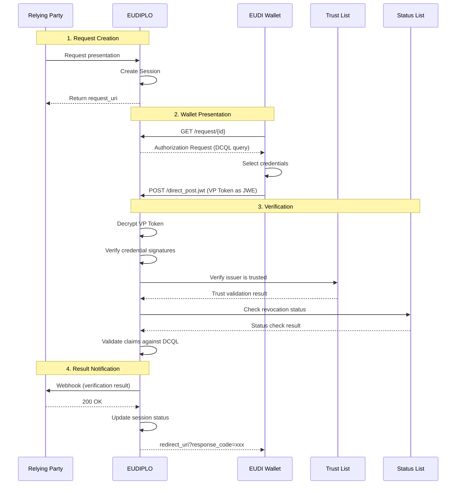
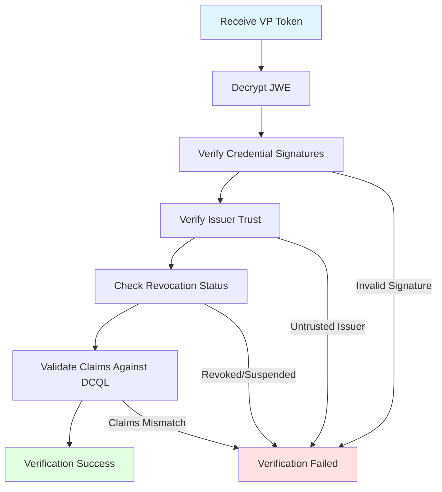
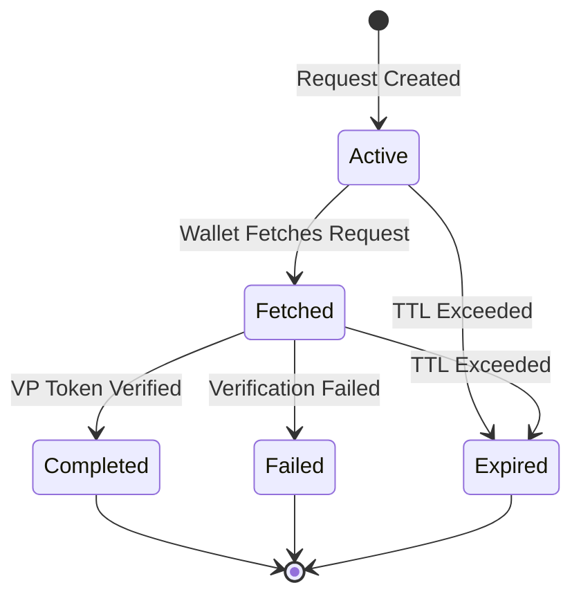

# Presentation Architecture

This page provides an architecture-level overview of how EUDIPLO implements the **OpenID for Verifiable Presentations (OID4VP)** protocol. For usage-level documentation and configuration examples, see [Presentation Configuration](../presentation/index.md).

---

## Overview

EUDIPLO implements OID4VP to enable verifiable credential presentation and verification. The presentation flow allows a **verifier** (relying party) to request credentials from a wallet and verify their authenticity:

1. **Request Creation**: EUDIPLO creates a presentation request (using DCQL or OID4VP descriptor)
2. **Wallet Response**: The wallet submits a VP Token (encrypted as JWE if configured)
3. **Verification**: EUDIPLO verifies the credential signatures, claims, and trust chain
4. **Trust Validation**: EUDIPLO checks that the issuer is trusted (via trust lists or federation)
5. **Status Check**: EUDIPLO checks revocation/suspension status (if configured)
6. **Webhook Notification**: The verification result is sent to the configured webhook endpoint

---

## Presentation Flow Diagram



---

## Module Structure

The presentation architecture is organized into several modules within `apps/backend/src/verifier`:

```text
verifier/
  ├── presentations/          # Presentation configuration entities
  │   ├── dto/                # Request/response DTOs
  │   └── entities/           # PresentationConfig entity
  ├── oid4vp/                 # OID4VP protocol implementation
  │   ├── request/            # Request generation (/request/{id})
  │   ├── response/           # Response handling (direct_post.jwt)
  │   ├── metadata/           # Metadata endpoints (.well-known/*)
  │   └── dc-api/             # Digital Credentials API (browser-native)
  ├── verifier-offer/         # Presentation request creation API
  ├── iso18013/               # ISO 18013-7 (mDOC presentation via DC API)
  └── resolver/               # Trust and status resolution
```

---

## Presentation Request

The presentation request specifies which credentials the verifier requires and how the wallet should respond.

**Request Structure (DCQL):**

```json
{
    "response_type": "vp_token",
    "response_mode": "direct_post.jwt",
    "client_id": "https://eudiplo.example.com/tenant1/verifier",
    "nonce": "unique-nonce",
    "presentation_definition": {
        "id": "age-verification",
        "dcql_query": {
            "credentials": [{
                "id": "age_credential",
                "format": "dc+sd-jwt",
                "meta": { "vct_values": ["urn:eu:age-over-18"] },
                "claims": [{ "path": ["age"], "values": ["18+"] }]
            }]
        }
    }
}
```

**Session Creation:**

When a presentation request is created, EUDIPLO generates a new `Session` entity:

- **ID**: UUID (referenced as `walletNonce` per OID4VP §13.3)
- **Status**: `active`
- **Credential Query**: DCQL query or presentation definition
- **Response Mode**: `direct_post.jwt` (wallet posts VP Token directly)
- **Security Fields**:
    - `walletNonce`: Wallet-facing identifier (distinct from internal session ID)
    - `responseCode`: One-time code for same-device redirect (prevents session fixation)

---

## Request Delivery

Presentation requests can be delivered in two ways:

### 1. Request URI (Recommended)

The verifier embeds a `request_uri` in the QR code or deep link. The wallet dereferences this URI to fetch the full request.

**QR Code Content:**

```text
openid4vp://?request_uri=https://eudiplo.example.com/tenant1/verifier/request/uuid
```

**Flow:**

1. Wallet scans QR code
2. Wallet fetches request from `request_uri`
3. Wallet presents credentials to `response_uri`

**Benefits:**

- QR code size is small (only contains URI)
- Request can be dynamically generated
- Request can include large trust lists or credential queries

---

### 2. Request Object (Inline)

The entire request is embedded in the QR code as a signed JWT.

**Limitation:** QR code size is limited (max ~2953 bytes for QR v40). Large DCQL queries or trust lists may exceed this limit.

---

## DCQL (Digital Credentials Query Language)

EUDIPLO uses **DCQL** to specify credential requirements. DCQL is a structured query language that supports:

- **Multiple credential sets**: Wallet can choose which set to present
- **Selective disclosure**: Request specific claims without revealing others
- **Value constraints**: Require specific claim values (e.g., `age >= 18`)
- **Intent to retain**: Allow wallet to retain claims in mDOC responses

**Example (Age Verification):**

```json
{
    "credential_sets": [[{
        "id": "age_credential",
        "format": "dc+sd-jwt",
        "meta": { "vct_values": ["urn:eu:age-over-18"] },
        "claims": [
            { "path": ["credentialSubject", "birthDate"] },
            { "path": ["credentialSubject", "age"], "values": ["18+"] }
        ]
    }]]
}
```

**Nested Sets:**

DCQL supports nested credential sets (`[[ ]]`) where:

- **Outer array**: Credential sets (wallet chooses one set)
- **Inner array**: Credentials within a set (wallet must provide all)

**Example (Diploma OR Employment Verification):**

```json
{
    "credential_sets": [
        [{ "format": "dc+sd-jwt", "meta": { "vct_values": ["diploma"] } }],
        [{ "format": "dc+sd-jwt", "meta": { "vct_values": ["employment"] } }]
    ]
}
```

---

## Wallet Response

The wallet submits the VP Token to the `response_uri` specified in the presentation request.

**Response Mode: `direct_post.jwt`**

The VP Token is encrypted as a JWE (JSON Web Encryption) and posted directly to EUDIPLO's response endpoint.

**Encryption:**

If the presentation configuration specifies a response encryption key, the VP Token is encrypted using JWE:

```text
POST /direct_post.jwt
Content-Type: application/x-www-form-urlencoded

response=<JWE_ENCRYPTED_VP_TOKEN>
```

**Decryption:**

EUDIPLO decrypts the JWE using the configured key chain (usage: `encrypt`).

**VP Token Structure:**

```json
{
    "vp": "<Base64-encoded verifiable presentation>",
    "nonce": "wallet-nonce",
    "aud": "https://eudiplo.example.com/tenant1/verifier"
}
```

---

## Verification Pipeline

Once the VP Token is received, EUDIPLO runs a multi-stage verification pipeline:



### 1. Signature Verification

EUDIPLO verifies the cryptographic signature of each credential:

- **SD-JWT VC**: Verify JWT signature using the issuer's public key (from `x5c` header or federation metadata)
- **mDOC**: Verify COSE signature using the issuer's certificate chain

**Algorithm:** ES256 (ECDSA with P-256 curve)

---

### 2. Trust Validation

EUDIPLO checks that the credential issuer is trusted according to the configured trust model:

| Trust Model | Validation Method |
| ------------- | ------------------- |
| **ETSI Trust List** | Check that the issuer's certificate is in the trust list |
| **OpenID Federation** | Resolve trust chain from trust anchor to issuer entity |
| **Allow List** | Check that the issuer entity ID is in the configured allow list |
| **None** | Skip trust validation (development only) |

**Trust List Verification:**

When using ETSI trust lists, EUDIPLO:

1. Fetches the trust list JWT from the configured URL
2. Verifies the trust list signature using the configured verifier key
3. Checks that the issuer's certificate or entity ID is in the trust list

{/*TODO(verify): Confirm whether trust list verification also checks certificate validity dates and revocation*/}

---

### 3. Status Check

EUDIPLO checks whether the credential has been revoked or suspended:

**OAuth Token Status List:**

1. Extract the status list reference from the credential (`status` claim)
2. Fetch the status list JWT from the issuer
3. Verify the status list signature
4. Check the bit at the specified index

**Status Values:**

| Bit Value | Status | Meaning |
| ----------- | -------- | --------- |
| `0x00` | Valid | Credential is active |
| `0x01` | Revoked | Credential is permanently revoked |
| `0x02` | Suspended | Credential is temporarily suspended |

**Revocation Policy:**

The presentation configuration specifies the revocation check mode:

| Mode | Behavior |
| ------ | ---------- |
| `required` | Fail verification if status check is unavailable |
| `optional` | Proceed with warning if status check is unavailable |
| `disabled` | Skip status check entirely |

---

### 4. Claims Validation

EUDIPLO validates that the presented credentials match the DCQL query:

- **Format**: Credential format matches (`dc+sd-jwt`, `mso_mdoc`)
- **VCT/DocType**: Credential type matches (for SD-JWT VC, `vct` claim; for mDOC, `doctype`)
- **Claims**: Required claims are present and match value constraints
- **Selective Disclosure**: Only requested claims are disclosed (no unexpected data)

**Value Constraints:**

DCQL supports value constraints for claim validation:

```json
{
    "claims": [
        { "path": ["age"], "values": ["18+"] }
    ]
}
```

EUDIPLO validates that the presented `age` claim is `>= 18`.

---

## Session Security (OID4VP §13.3)

EUDIPLO implements the **OID4VP §13.3 security model** to prevent session fixation and replay attacks:

### Wallet Nonce

The `walletNonce` is a wallet-facing identifier that is **distinct from the internal session ID**. This prevents an attacker from guessing or enumerating session IDs.

**Flow:**

1. Verifier creates a presentation request with `nonce: walletNonce`
2. Wallet includes the nonce in the VP Token
3. EUDIPLO correlates the VP Token with the session via the `walletNonce`

---

### Response Code

For same-device flows (e.g., verifier and wallet on the same device), EUDIPLO generates a one-time `response_code` that is appended to the `redirect_uri`:

**Flow:**

1. Wallet submits VP Token to `/direct_post.jwt`
2. EUDIPLO validates the VP Token
3. EUDIPLO generates a one-time `response_code` and stores it in the session
4. EUDIPLO redirects the wallet to `redirect_uri?response_code=xxx`
5. Verifier exchanges the `response_code` for the verification result

**Security:**

The `response_code` is single-use and expires after 5 minutes. This prevents session fixation attacks where an attacker embeds a stolen `redirect_uri` in a malicious QR code.

---

## Digital Credentials API (DC API)

EUDIPLO supports the **Digital Credentials API** (browser-native credential exchange without QR codes or redirects). This enables seamless credential presentation in web applications.

**Supported Protocols:**

| Protocol | Description |
|----------|-------------|
| `oid4vp` | OpenID4VP via DC API |
| `iso-18013-7` | ISO 18013-7 (mDOC presentation via DC API) |

**Flow:**

1. Verifier creates a presentation request with `useDcApi: true`
2. EUDIPLO returns a `dcapi://` URL instead of `openid4vp://`
3. Browser invokes the DC API
4. Wallet handles the presentation request natively
5. Wallet submits VP Token to EUDIPLO

See [Presentation Requests](../presentation/presentation-requests.md) for detailed DC API documentation.

---

## Webhook Integration

After verification completes, EUDIPLO sends the result to the configured webhook endpoint.

**Webhook Payload:**

```json
{
    "sessionId": "session-uuid",
    "status": "completed",
    "verified": true,
    "credentials": [{
        "format": "dc+sd-jwt",
        "vct": "urn:eu:age-over-18",
        "claims": {
            "age": "25",
            "birthDate": "1999-01-01"
        }
    }],
    "timestamp": "2024-01-01T12:00:00Z"
}
```

**Webhook Configuration:**

Webhooks are defined via `WebhookEndpoint` entities:

```json
{
    "id": "my-webhook",
    "url": "https://app.example.com/webhook",
    "secret": "${WEBHOOK_SECRET}",
    "events": ["presentation.completed"]
}
```

**Signing:**

Webhook payloads are signed using HMAC-SHA256. The signature is included in the `X-Webhook-Signature` header.

---

## Session Lifecycle

The session tracks the state of the presentation flow:



**Session Cleanup:**

Sessions are cleaned up based on the tenant's `sessionConfig`:

| Cleanup Mode | Behavior |
|--------------|----------|
| `full` | Completely delete the session and all associated data |
| `anonymize` | Keep metadata (status, timestamps) but remove personal data (VP Token, claims) |

**Single-Use Enforcement:**

Sessions are marked `consumed: true` after the first VP Token submission. This prevents replay attacks.

---

## Key Management Integration

The presentation flow integrates with the Key Management system:

| Operation | Key Chain | Algorithm |
| ----------- | ----------- | ----------- |
| **VP Token Decryption** | Encryption key chain (usage: `encrypt`) | ECDH-ES+A256KW (JWE) |
| **Trust List Verification** | Trust list key chain (usage: `trustList`) | ES256 |
| **Status List Verification** | Status list key chain (usage: `statusList`) | ES256 |

See [Cryptography](./cryptography.md) for key management details.

---

## Protocol Coverage

EUDIPLO implements the following OID4VP features:

| Feature | Supported | Notes |
| --------- | ----------- | ------- |
| `direct_post.jwt` Response Mode | ✅ | Wallet posts VP Token directly to verifier |
| DCQL | ✅ | Structured credential queries with selective disclosure |
| Session Identifier Separation (§13.3) | ✅ | `walletNonce` distinct from internal session ID |
| Response Code for Same-Device Redirect (§13.3) | ✅ | One-time `response_code` prevents session fixation |
| JWE-Encrypted Authorization Responses | ✅ | VP Tokens encrypted to verifier's key |
| `x509_san_dns` / `x509_san_uri` Client ID Scheme | ✅ | Verifier identification via X.509 certificates |
| Wallet Attestation Verification | ✅ | Validate wallet provider trustworthiness |
| Digital Credentials API (DC API) | ✅ | Browser-native credential exchange |

See [Supported Protocols](../reference/protocols.md) for full protocol coverage.

---

## Next Steps

- **Usage Guide**: [Presentation Configuration](../presentation/index.md)
- **DCQL Reference**: [DCQL Documentation](../presentation/dcql.md)
- **Trust Lists**: [Trust List Management](../trust/trust-lists.md)
- **Status Lists**: [Revocation and Suspension](../issuance/status-management.md)
- **ISO 18013-7**: [Presentation Requests](../presentation/presentation-requests.md)
- **Key Management**: [Cryptography](./cryptography.md)
- **Session Management**: [Sessions](./sessions.md)
