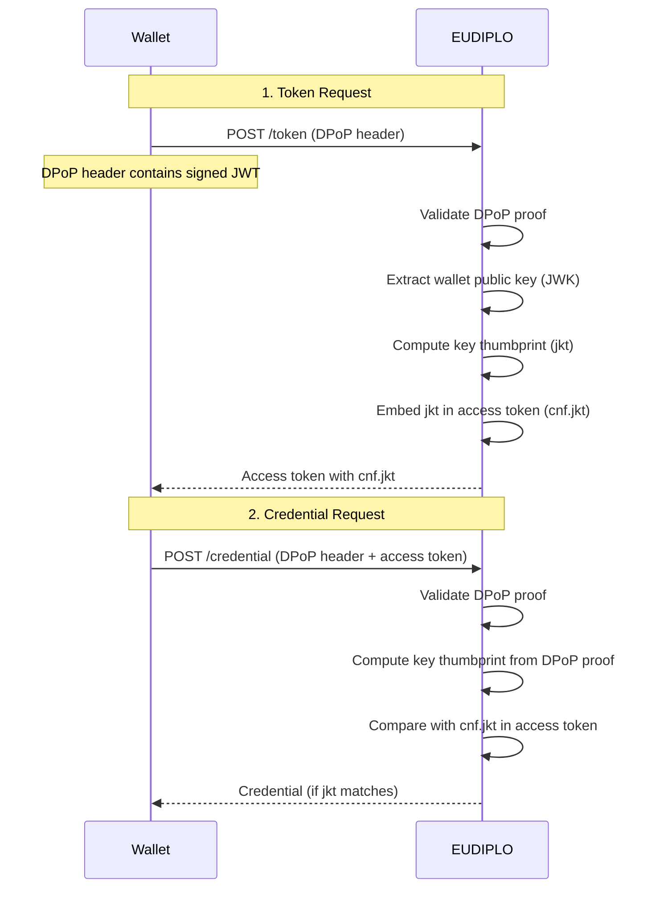
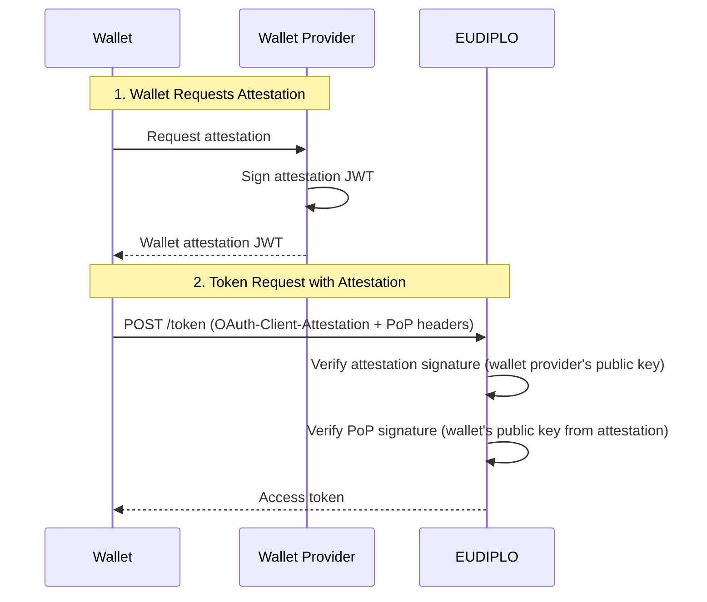

# Security Architecture

This page provides an overview of EUDIPLO's security architecture, including cryptographic algorithms, token validation, DPoP support, and secret handling policies.

---

## Cryptographic Algorithms

EUDIPLO uses **ES256 (ECDSA with P-256 curve)** as the primary signing algorithm across all protocols:

| Operation | Algorithm | Curve | Notes |
| ----------- | ----------- | ------- | ------- |
| **Access Token Signing** | ES256 | P-256 | JWT signed by issuer AS |
| **SD-JWT VC Signing** | ES256 | P-256 | Credential signed by issuer attestation key |
| **mDOC Signing** | ES256 | P-256 | Mobile Security Object (MSO) signed via COSE |
| **Status List Signing** | ES256 | P-256 | OAuth Token Status List JWT signed by issuer |
| **Trust List Signing** | ES256 | P-256 | ETSI TL or OpenID Federation metadata signed by trust anchor |
| **VP Token Signing** | ES256 | P-256 | Verifiable Presentation signed by wallet |

**Rationale:**

ES256 is the **EUDI Wallet Architecture Reference Framework (ARF) baseline requirement** and is widely supported across EUDI ecosystem implementations. Alternative algorithms (RS256, EdDSA) may be added in future releases based on interoperability requirements.

---

## Key Loading and Storage

EUDIPLO enforces **asynchronous key loading** to prevent blocking the main application thread during key retrieval from external KMS providers.

### Key Providers

All signing keys are managed via pluggable **KMS providers**:

| Provider | Description | Use Case |
| ---------- | ------------- | ---------- |
| `db` | Database-stored keys (encrypted at rest) | Development, testing, small-scale deployments |
| `vault` | HashiCorp Vault Transit secrets engine | Production environments with centralized key management |
| `aws-kms` | AWS Key Management Service | Cloud-native deployments on AWS |
| `pkcs11` | PKCS#11 Hardware Security Module | High-security environments (air-gapped, FIPS compliance) |
| `http` | Remote KMS microservice | Custom key management infrastructure |
| `csc` | Cloud Signature Consortium (CSC) API | Remote signature services |

See [Key Management](../administration/kms.md) for provider configuration.

---

### Secret Handling Policy

EUDIPLO enforces a **zero-secret-export policy** for private key material:

| Scenario | Policy |
| ---------- | -------- |
| **Private Keys in Configuration Bundles** | ❌ **Never exported** — Private keys are always generated or stored in the KMS provider and are never included in configuration bundles. |
| **Private Keys in API Responses** | ❌ **Never returned** — The Key Chain API only returns public key material (JWK public key or X.509 certificate). |
| **Environment Variable Placeholders** | ✅ **Allowed in `kms.json`** — Secret references (e.g., `${VAULT_TOKEN}`) are permitted for KMS provider configuration. |
| **Encryption Keys** | ⚠️ **Database-only** — Encryption keys (for decrypting VP Tokens) are always stored in the database. These are never loaded from external KMS providers. |

**Audit Logging:**

All private key operations (signing, key generation, key rotation) are logged via the `AuditLogService` for compliance tracking. Logs include:

- Timestamp
- Tenant ID
- Key Chain ID
- Operation type (`sign`, `generate`, `rotate`, `delete`)
- User/service identity (if authenticated)

---

## Token Validation

EUDIPLO enforces strict JWT validation for all token-based flows (access tokens, VP tokens, credentials).

### Required Claims

| Claim | Description | Validation Rule |
| ------- | ------------- | ----------------- |
| `iss` (Issuer) | Token issuer identifier | Must match expected issuer (tenant URL or configured external AS) |
| `aud` (Audience) | Token audience | Must include EUDIPLO's tenant base URL |
| `exp` (Expiration) | Expiration timestamp | Token must not be expired (current time < `exp`) |
| `nbf` (Not Before) | Not-before timestamp | Token must be valid (current time >= `nbf`) |
| `iat` (Issued At) | Issuance timestamp | Token must not be issued in the future (current time >= `iat`) |

**Clock Skew Tolerance:**

EUDIPLO allows a **30-second clock skew** for `exp`, `nbf`, and `iat` validation to account for minor time synchronization differences between systems.

---

### Access Token Validation (OID4VCI)

When a wallet presents an access token at the credential endpoint, EUDIPLO verifies:

1. **Signature**: Verify JWT signature using the issuer's public key (from JWKS or X.509 cert)
2. **Issuer**: Check that `iss` matches the expected AS endpoint
3. **Audience**: Check that `aud` includes the credential issuer URL
4. **Expiration**: Check that `exp` is in the future
5. **Session Correlation**: Extract `issuer_state` and correlate with active session
6. **DPoP Binding** *(if enabled)*: Verify `cnf.jkt` matches the DPoP proof key thumbprint

**Example Access Token:**

```json
{
    "iss": "https://eudiplo.example.com/tenant1/issuer",
    "sub": "wallet-client-id",
    "aud": "https://eudiplo.example.com/tenant1",
    "exp": 1234567890,
    "iat": 1234567800,
    "issuer_state": "session-uuid",
    "client_id": "wallet-client-id",
    "cnf": {
        "jkt": "dpop-key-thumbprint"
    }
}
```

---

### VP Token Validation (OID4VP)

When a wallet submits a VP Token, EUDIPLO verifies:

1. **Decryption**: Decrypt JWE using the configured encryption key (if VP Token is encrypted)
2. **Signature**: Verify each credential's signature using the issuer's public key
3. **Nonce**: Verify the `nonce` claim matches the session's `walletNonce`
4. **Audience**: Verify the `aud` claim matches the verifier's client ID
5. **Trust Validation**: Verify the credential issuer is trusted (via trust list or federation)
6. **Status Check**: Verify the credential is not revoked or suspended (via status list)
7. **Claims Validation**: Verify presented claims match the DCQL query

See [Presentation Architecture](./presentation.md) for detailed verification flow.

---

## DPoP (Demonstrating Proof-of-Possession)

EUDIPLO supports **DPoP (RFC 9449)** to bind access tokens to the wallet's public key. This prevents token theft and replay attacks.

### DPoP Flow



### DPoP Proof Structure

The DPoP proof is a signed JWT included in the `DPoP` HTTP header:

```json
{
    "typ": "dpop+jwt",
    "alg": "ES256",
    "jwk": {
        "kty": "EC",
        "crv": "P-256",
        "x": "...",
        "y": "..."
    }
}
.
{
    "jti": "unique-jti",
    "htm": "POST",
    "htu": "https://eudiplo.example.com/tenant1/issuer/token",
    "iat": 1234567800
}
```

**Claims:**

| Claim | Description |
|-------|-------------|
| `jti` | Unique JWT ID (prevents replay) |
| `htm` | HTTP method (`POST`, `GET`) |
| `htu` | HTTP URI (request endpoint URL) |
| `iat` | Issued-at timestamp |

**Validation:**

1. Verify JWT signature using the `jwk` claim
2. Verify `htm` matches the HTTP method
3. Verify `htu` matches the request URL
4. Verify `iat` is recent (within 60 seconds)
5. Verify `jti` has not been used before (replay prevention)

**Configuration:**

DPoP is enabled per issuance configuration:

```json
{
    "dPopRequired": true
}
```

---

## Wallet Attestation

EUDIPLO supports **Wallet Attestation (OAuth 2.0 Client Attestation PoP)** to verify the wallet provider's trustworthiness before issuing credentials.

### Wallet Attestation Flow



### Attestation Headers

| Header | Description |
|--------|-------------|
| `OAuth-Client-Attestation` | Wallet provider's signed attestation JWT (includes wallet's public key) |
| `OAuth-Client-Attestation-PoP` | Wallet's proof-of-possession JWT (signed with wallet's private key) |

**Attestation JWT:**

```json
{
    "iss": "https://wallet-provider.example.com",
    "sub": "wallet-instance-id",
    "iat": 1234567800,
    "exp": 1234567890,
    "cnf": {
        "jwk": {
            "kty": "EC",
            "crv": "P-256",
            "x": "...",
            "y": "..."
        }
    }
}
```

**PoP JWT:**

```json
{
    "iss": "wallet-instance-id",
    "aud": "https://eudiplo.example.com/tenant1",
    "iat": 1234567800,
    "jti": "unique-jti"
}
```

**Validation:**

1. Verify attestation JWT signature using wallet provider's public key (from trust list or JWKS)
2. Verify attestation is not expired (`exp`)
3. Extract wallet's public key from attestation (`cnf.jwk`)
4. Verify PoP JWT signature using wallet's public key
5. Verify PoP `aud` matches the issuer URL
6. Verify PoP `jti` has not been used before (replay prevention)

**Configuration:**

Wallet attestation is enabled per issuance configuration:

```json
{
    "walletAttestationRequired": true
}
```

---

## Session Security (OID4VP §13.3)

EUDIPLO implements the **OID4VP §13.3 session security model** to prevent session fixation and replay attacks.

### Wallet Nonce Separation

The `walletNonce` is a **wallet-facing session identifier** that is **distinct from the internal session ID**. This prevents attackers from enumerating or guessing session IDs.

**Flow:**

1. EUDIPLO creates a presentation request with `nonce: walletNonce`
2. Wallet includes the nonce in the VP Token
3. EUDIPLO correlates the VP Token with the session via the `walletNonce`
4. EUDIPLO **never exposes the internal session ID** to the wallet

**Database Schema:**

```typescript
@Entity()
export class Session {
    @PrimaryGeneratedColumn('uuid')
    id: string; // Internal session ID (never exposed)

    @Column({ unique: true })
    walletNonce: string; // Wallet-facing nonce (exposed in protocol)

    // ...
}
```

---

### Response Code (Same-Device Redirect)

For same-device flows (e.g., verifier and wallet on the same device), EUDIPLO generates a **one-time `response_code`** to prevent session fixation attacks.

**Flow:**

1. Wallet submits VP Token to `/direct_post.jwt`
2. EUDIPLO validates the VP Token
3. EUDIPLO generates a one-time `response_code` and stores it in the session
4. EUDIPLO redirects the wallet to `redirect_uri?response_code=xxx`
5. Verifier exchanges the `response_code` for the verification result

**Security Properties:**

| Property | Enforcement |
| ---------- | ------------- |
| **Single-Use** | Response code is consumed after first use |
| **Short-Lived** | Expires after 5 minutes |
| **Random** | Cryptographically random (32 bytes) |
| **Session-Bound** | Only valid for the session that created it |

**Attack Prevention:**

This prevents an attacker from:

- Embedding a stolen `redirect_uri` in a malicious QR code
- Correlating the wallet's session with a different verifier's session
- Replaying a `response_code` from a previous presentation

---

## Secret Handling

EUDIPLO enforces strict policies to prevent accidental exposure of secrets, private keys, and user PII.

### Secrets in Configuration

| Secret Type | Storage | Policy |
| ------------- | --------- | -------- |
| **Private Keys** | KMS provider (never in config files) | ❌ Never exported or included in config bundles |
| **Database Passwords** | Environment variables | ✅ Must use `${DB_PASSWORD}` placeholder in config files |
| **KMS Tokens** | Environment variables | ✅ Must use `${VAULT_TOKEN}` placeholder in `kms.json` |
| **Webhook Secrets** | Environment variables | ✅ Must use `${WEBHOOK_SECRET}` placeholder in webhook config |
| **API Keys (Attribute Providers)** | Environment variables | ✅ Must use `${API_KEY}` placeholder in attribute provider config |

**Configuration Export:**

When exporting configuration bundles via the management API:

- Private keys are **never included** (only public keys and certificates)
- Secret placeholders are **preserved** (e.g., `${DB_PASSWORD}`)
- Sensitive session data is **excluded** (user claims, VP tokens)

---

### Secrets in Logs

EUDIPLO uses **Pino logger** with automatic secret redaction:

| Logged Field | Redaction Policy |
| -------------- | ------------------ |
| **Access Tokens** | ❌ Never logged (even redacted) |
| **Private Keys** | ❌ Never logged |
| **User PII** | ❌ Never logged unless explicitly enabled for debugging |
| **DPoP Proofs** | ⚠️ Logged at `debug` level only (contains public key, not secret) |
| **VP Tokens** | ⚠️ Logged at `debug` level only (for debugging failed verifications) |
| **Credential Claims** | ⚠️ Logged at `debug` level only (for debugging issuance) |

**Audit Logging:**

The `AuditLogService` persists compliance events to the database. Audit logs include:

- Timestamp
- Tenant ID
- User/service identity
- Operation type
- Success/failure status
- **Redacted request/response payloads** (no secrets or PII)

---

## HTTPS and TLS

EUDIPLO **requires HTTPS in production** for all external endpoints:

| Endpoint Type | HTTPS Requirement | Notes |
| --------------- | ------------------- | ------- |
| **Issuer Endpoints** | ✅ Required | All OID4VCI endpoints must use HTTPS |
| **Verifier Endpoints** | ✅ Required | All OID4VP endpoints must use HTTPS |
| **Webhook Endpoints** | ✅ Required | Outbound webhook requests use HTTPS |
| **Management API** | ✅ Required | All API endpoints must use HTTPS |
| **Local Development** | ⚠️ Optional | HTTP allowed when `NODE_ENV=development` |

**TLS Configuration:**

EUDIPLO does not terminate TLS itself. Deploy behind a reverse proxy (e.g., NGINX, Traefik, AWS ALB) to handle TLS termination.

**Certificate Trust:**

For external KMS providers (e.g., Vault, AWS KMS), EUDIPLO validates TLS certificates using the system's default trust store. Custom CA certificates can be added via the `NODE_EXTRA_CA_CERTS` environment variable.

---

## CORS (Cross-Origin Resource Sharing)

EUDIPLO enforces **strict CORS policies** for browser-based wallet interactions:

| Endpoint Type | CORS Policy |
| --------------- | ------------- |
| **Protocol Endpoints** | ✅ CORS enabled for all OID4VCI/OID4VP endpoints |
| **Management API** | ❌ CORS disabled (API access requires server-to-server authentication) |
| **Digital Credentials API** | ✅ CORS enabled for DC API endpoints |

**Allowed Origins:**

By default, EUDIPLO allows CORS requests from **all origins** for protocol endpoints (to support wallet apps from any domain). For production deployments, configure the `CORS_ORIGINS` environment variable to restrict allowed origins:

```bash
CORS_ORIGINS=https://wallet.example.com,https://app.example.com
```

---

## Rate Limiting

EUDIPLO includes built-in **rate limiting** to prevent abuse and denial-of-service attacks:

| Endpoint Type | Rate Limit | Window |
| --------------- | ------------ | -------- |
| **Token Endpoint** | 10 requests/min per IP | Rolling 60-second window |
| **Credential Endpoint** | 20 requests/min per access token | Rolling 60-second window |
| **Offer Endpoints** | 100 requests/min per tenant | Rolling 60-second window |
| **Management API** | 60 requests/min per API key | Rolling 60-second window |

**Configuration:**

Rate limits can be customized via environment variables:

```bash
RATE_LIMIT_TOKEN=10
RATE_LIMIT_CREDENTIAL=20
RATE_LIMIT_OFFER=100
```

---

## Security Checklist

Before deploying EUDIPLO to production, verify:

- ✅ **HTTPS enabled** for all external endpoints
- ✅ **KMS provider configured** (not using `db` provider in production)
- ✅ **Environment variables** used for all secrets (no hardcoded secrets)
- ✅ **Session cleanup** enabled with appropriate retention policy
- ✅ **Rate limiting** configured for protocol endpoints
- ✅ **CORS origins** restricted to trusted wallet domains
- ✅ **Audit logging** enabled and persisted to secure storage
- ✅ **TLS certificates** valid and trusted
- ✅ **DPoP enforcement** enabled for production credential issuance
- ✅ **Wallet attestation** enabled for high-security use cases
- ✅ **Trust list validation** configured for credential verification

---

## Next Steps

- **Cryptography**: [Key Management and Algorithms](./cryptography.md)
- **Chained AS**: [Authorization Architecture](./authorization.md)
- **Key Management**: [KMS Providers](../administration/kms.md)
- **Session Management**: [Session Lifecycle](./sessions.md)
- **Issuance Flow**: [Issuance Architecture](./issuance.md)
- **Presentation Flow**: [Presentation Architecture](./presentation.md)
