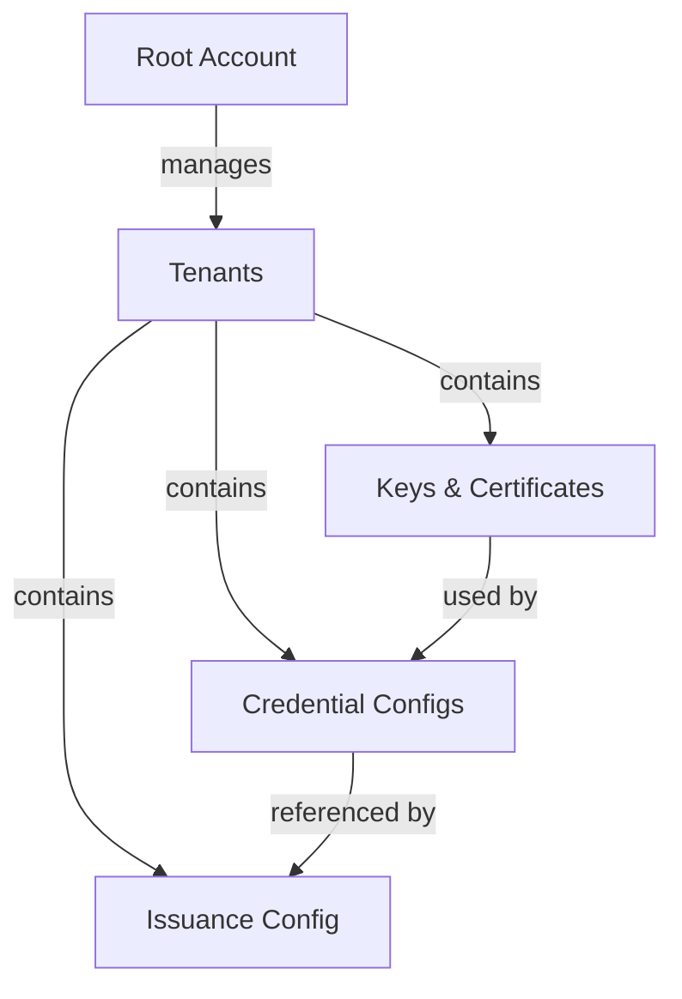

You've started EUDIPLO—now let's issue your first credential. This guide walks you through creating a credential configuration, setting up issuance, and sending a credential offer to a wallet.

:::info[Prerequisites]
Complete the [Quick Start](quick-start.md) guide first. You should have EUDIPLO running with both backend and client:

- Backend: [http://localhost:3000](http://localhost:3000)
- Web Client: [http://localhost:4200](http://localhost:4200)

:::

## Understanding the Setup

EUDIPLO uses a hierarchical structure:



| Concept                 | Description                                                               |
| ----------------------- | ------------------------------------------------------------------------- |
| **Root Account**        | The default admin account. Used to create and manage tenants.             |
| **Tenant**              | An isolated workspace with its own keys, credentials, and configurations. |
| **Keys & Certificates** | Cryptographic keys for signing credentials. Auto-generated on first use.  |
| **Credential Config**   | Defines what a credential looks like (claims, format, display).           |
| **Issuance Config**     | Groups credential configs and defines issuer metadata.                    |

## Step 1: Login as Root

1. Open the Web Client at **[http://localhost:4200](http://localhost:4200)**
2. Enter:
    - **EUDIPLO Instance**: `http://localhost:3000`
    - **Client ID**: Your configured `AUTH_CLIENT_ID`
    - **Client Secret**: Your configured `AUTH_CLIENT_SECRET`
3. Click **Login**

:::warning[Credentials are REQUIRED]
You must set these environment variables before starting the service:

```env
AUTH_CLIENT_ID=your-client-id
AUTH_CLIENT_SECRET=your-client-secret
MASTER_SECRET=your-32-character-minimum-secret
```

The application will fail to start without these values. See [Authentication](../administration/authentication.md) for details.
:::

## Step 2: Create Your First Tenant

Tenants provide isolation—each tenant has its own keys, credentials, and configurations.

:::tip[Demo Configuration Available]
EUDIPLO includes demo configuration files in `assets/config/demo/` that can be automatically imported on startup. Set `CONFIG_IMPORT_MODE=create` and `CONFIG_FOLDER` to the config directory to import keys, certificates, credential configs, and presentation configs automatically. This is useful for development and testing.
:::

1. Navigate to **Tenants** in the sidebar
2. Click **+ Create Tenant**
3. Fill in:
    - **ID**: `my-org` (unique identifier for the tenant)
    - **Name**: `My Organization`
    - **Description**: Optional description
    - **Roles**: Select all roles for a full setup
4. Click **Save**
5. A dialog appears showing the **client credentials** for the new tenant:
    - **Save the secret now!** It won't be shown again.
    - Use the **Copy** buttons to save the credentials
    - Click **Login as this Client** to switch to the new tenant immediately

:::warning[Save your credentials!]
Client secrets are securely hashed and cannot be retrieved later. If you lose the secret, use the **Rotate Secret** button in the client list to generate a new one.
:::

## Step 3: Create a Credential Configuration

Now define what your credential will contain and how it looks. The wizard walks you through five steps: **Basics**, **Claims**, **Appearance**, **Settings**, and **Review**.

1. Navigate to **Issuance** → **Credential Configs** in the sidebar
2. Click **+ Create**
3. Click **Templates** (top-right corner) and select a template like `PID (SD-JWT VC)`

:::tip[Templates save time]
Templates provide pre-configured credential types with proper claims, display settings, and formats. They're the fastest way to get started!
:::

1. In **Basics**, review the ID, description, format, and credential type (VCT or mDOC document type), then click **Continue**
2. In **Claims**, review the fields to issue and click **Continue**
3. In **Appearance**, review the wallet display name and locale, then click **Continue**
4. In **Settings**, keep the defaults for lifetime, signing key, and status management, then click **Continue**
5. In **Review**, check the resulting configuration and click **Create Configuration**

:::tip[Guided vs. full editor]
Use **Show all settings** to switch to a single form with direct tab navigation. Existing configurations always open this way. Both modes share the same form and preserve your changes.
:::

## Step 4: Configure Issuance Settings

The issuance configuration defines how your issuer presents itself to wallets. This wizard has four steps: **Identity**, **Wallet access**, **Trust**, and **Review**.

1. Navigate to **Issuance** → **Issuance Config**
2. In **Identity**, enter a **Name** (e.g. `My Issuer`) and **Locale**, then click **Continue**
3. In **Wallet access**, keep the built-in authorization server, expand **Issuance behavior (advanced)**, and set:
    - **DPoP Required**: **Disabled** ⚠️
    - **Batch Size**: `1`

    Click **Continue**
4. In **Trust**, review the trust requirements summary and click **Continue**
5. In **Review**, check the configuration and click **Create Configuration**

:::warning[DPoP Compatibility]
Keep **DPoP Required** disabled for maximum wallet compatibility. Many wallets don't support DPoP yet. You can enable it later for additional security once you've verified your target wallets support it.
:::

## Step 5: Issue Your First Credential! 🎉

Now create a credential offer and send it to a wallet.

1. Navigate to **Issuance** → **Sessions**
2. Click **+ New Offer**
3. Configure the offer:
    - **Credential**: Select your credential configuration
    - **Flow**: Select `Pre-authorized` (simplest flow, no user authentication)
4. Enter the claim values:

    ```json
    {
        "given_name": "John",
        "family_name": "Doe",
        "birthdate": "1990-01-15"
    }
    ```

5. Click **Create Offer**
6. A **QR code** appears—scan it with a compatible wallet!

:::tip[Testing with a wallet]
See [Wallet Compatibility](../reference/wallet-compatibility.md) for a list of wallets that work with EUDIPLO. The EUDI Reference Wallet and Paradym Wallet are good options for testing.
:::

## What's Next?

You've successfully issued your first credential! Continue to:

- **[Request Your First Presentation](first-presentation.md)** — Verify credentials from wallets
