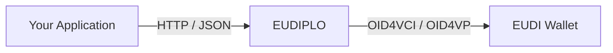

# What is EUDIPLO?

**EUDIPLO** is a lightweight, open-source **middleware layer** that bridges your
IT systems with the **European Digital Identity Wallet (EUDI Wallet)** ecosystem.

Whether you're building services for government, education, healthcare, or the
private sector, EUDIPLO lets you interact with EUDI Wallets using simple
JSON-based APIs, without having to implement complex identity protocols
yourself.

:::info[EUDIPLO stands for EUDI Protocol Liaison Operator]
The name EUDIPLO is inspired by diplomat, because this middleware acts as
a translator and trusted go-between. It speaks fluent EUDI specs on one side
and down-to-earth JSON on the other, so your backend doesn't have to become a
protocol expert overnight.
:::

## Where does it fit?



Your backend talks to EUDIPLO over simple, protocol-agnostic HTTP/JSON APIs.
EUDIPLO does the heavy lifting of speaking OID4VCI, OID4VP, SD-JWT VC, and
mDOC (ISO 18013-5) to the wallet, and calls you back via webhooks or session
events with the result.

## Why EUDIPLO?

Connecting to the EUDI Wallet ecosystem is technically demanding:

- You must understand **OID4VCI**, **OID4VP**, **SD-JWT VC**, **mDOC (ISO 18013-5)**,
  and **OAuth-based status protocols**.
- Libraries are scattered, often **incomplete or language-specific**.
- Hosted services can lead to **vendor lock-in** or obscure how your data is
  processed.

**EUDIPLO solves these problems** by acting as a protocol abstraction layer you
can run yourself, integrate over HTTP, and configure via JSON.

## Three ways to approach EUDIPLO

<div className="row">
<div className="col col--4">

### 🚀 Use EUDIPLO

Run EUDIPLO, issue your first credential, and verify your first presentation
in minutes.

**Start here:** [Getting Started](./getting-started/index.md)

</div>
<div className="col col--4">

### 🏗 Understand EUDIPLO

Learn how tenants, credential/issuance/presentation configurations, sessions,
and key chains relate — and how the pluggable database, storage, and KMS
backends fit together.

**Start here:** [Architecture](./architecture/index.md)

</div>
<div className="col col--4">

### 🛠 Contribute

Set up a local development environment, understand the monorepo layout, and
learn how to test and submit changes.

**Start here:** [Contributing](./contributing/index.md)

</div>
</div>

## Common tasks

| Task                            | Where to go                                            |
| ------------------------------- | ------------------------------------------------------ |
| Issue a credential              | [Issuance](./issuance/index.md)                        |
| Request/verify credentials      | [Presentation](./presentation/index.md)                |
| Configure claims                | [Claims](./issuance/claims.md)                         |
| Connect an authorization server | [Issuance: Authorization](./issuance/authorization.md) |
| Deploy to production            | [Deployment](./deployment/index.md)                    |
| Configure trust                 | [Trust & Security](./trust/index.md)                   |

## Key capabilities

| Capability                  | Description                                                                                   |
| --------------------------- | --------------------------------------------------------------------------------------------- |
| 🛂 **Issuance**             | Issue credentials to users through the EUDI Wallet                                            |
| 🧾 **Presentation**         | Request credentials from users and verify them                                                |
| 🔄 **Cross-Flow Support**   | Request credentials as part of an issuance flow                                               |
| 🔐 **Secure by Default**    | Built-in support for secure key handling and OAuth-based status checking                      |
| 🧱 **Plug and Play**        | Integrates with your backend over HTTP; no requirement to use a specific programming language |
| 🖥️ **Web Client Included**  | Comes with a ready-to-use web interface for easy testing and interaction                      |
| ⚙️ **JSON Configurable**    | Set up templates, trust roots, and issuers through JSON files                                 |
| 🇪🇺 **Wallet Compatible**    | Works with multiple [wallets](./reference/wallet-compatibility.md)                            |
| ✅ **OIDF Conformant**      | Tested against the OpenID Foundation conformance suite for OID4VCI and OID4VP                 |
| 👥 **Multi-Tenant Support** | Isolate configurations for different tenants or clients                                       |

## Try EUDIPLO

import Tabs from "@theme/Tabs";
import TabItem from "@theme/TabItem";

<Tabs>
<TabItem value="cli" label="Standalone CLI">

```bash
curl -fsSL https://eudiplo.dev/install.sh | bash
eudiplo demo
```

</TabItem>
<TabItem value="npm" label="Node.js / npm">

```bash
npx @eudiplo/cli demo
```

</TabItem>
</Tabs>

Both options run the same **EUDIPLO CLI**.

- **Standalone CLI**: native executable, no Node.js required.
- **npm package**: `@eudiplo/cli`, requires Node.js 22+.
- The demo requires Docker and Docker Compose, or Podman and Podman Compose.
- `eudiplo demo` creates a local demo deployment for evaluation, not production.

:::info[Documentation lifecycle]
The documentation on the `main` branch represents the current development state and is used for preview deployments. Published, stable documentation is frozen per major release version. This keeps the active docs current without creating a large number of historical snapshots for every minor or patch release.
:::

Continue with the [Getting Started guide](./getting-started/index.md).
