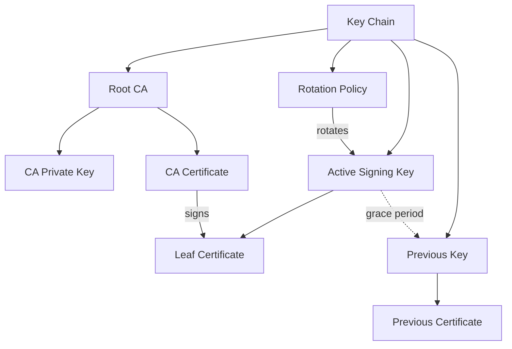

# Key Chains

A **key chain** is EUDIPLO's unified abstraction for managing cryptographic keys and their certificates together as a single entity. This eliminates orphaned keys and simplifies key lifecycle management.

## What Is a Key Chain?

A key chain encapsulates:

- **Active signing key** with its certificate
- **Optional root CA key** (for internal certificate chains / rotation)
- **Previous key** (for grace period after rotation)
- **Rotation policy** (automatic certificate renewal)



Each tenant can manage multiple key chains simultaneously. Each key chain has a unique ID and is isolated via the `tenant_id` field.

## Usage Types

Key chains are organized by usage type:

| Usage         | Purpose                                 |
| ------------- | --------------------------------------- |
| `access`      | Access certificates for wallet requests |
| `attestation` | Credential signing keys                 |
| `trustList`   | Trust list signing keys                 |
| `statusList`  | Status list signing keys                |
| `encrypt`     | Encryption keys for response encryption |

## Creating a Key Chain

### Via the Web UI

1. Navigate to **Keys** in the sidebar
2. Click **+ Create Key** to open the wizard
3. Select the usage type
4. Select how the key and certificate should be provisioned
5. Enter a description and select the KMS provider
6. Click **Create**

For standalone keys, choose the external certificate option to provide an existing private EC
JWK and certificate chain. The certificate's public key must match the private JWK. The wizard
accepts pasted PEM values and PEM, CRT, CER, or DER certificate files.

For an attestation key using an **External CA Chain**, provide the external CA private JWK and
certificate chain. EUDIPLO imports the CA key, generates the active signing key, has the CA sign
that key, and rotates the active signing key according to the configured policy. The last
certificate in the supplied chain must be the CA certificate matching the private JWK and must
have `CA=true`.

### Via the API

```bash
curl -X POST https://your-eudiplo-instance/keys \
  -H "Authorization: Bearer <token>" \
  -H "Content-Type: application/json" \
  -d '{
    "name": "my-key-chain",
    "usage": "attestation"
  }'
```

## KMS Provider Selection

When creating or importing a key through the API, include the `kmsProvider` field to select a specific provider by its `id`. If omitted, the `defaultProvider` from `kms.json` is used.

Example with specific provider:

```bash
curl -X POST https://your-eudiplo-instance/keys \
  -H "Authorization: Bearer <token>" \
  -H "Content-Type: application/json" \
  -d '{
    "name": "vault-backed-key",
    "usage": "attestation",
    "kmsProvider": "vault"
  }'
```

## Key Rotation

Key chains support automatic rotation based on certificate expiry. When a certificate approaches expiration, EUDIPLO generates a new key and certificate while keeping the previous key available during a grace period.

This ensures uninterrupted service during key transitions.

### External CA Rotation

An internal chain can use an external CA as its signing anchor. In this mode:

- The imported private key and final certificate in `crt` represent the CA
- EUDIPLO generates the active leaf signing key
- The external CA signs the generated leaf certificate
- EUDIPLO rotates the leaf key and certificate; the CA key remains the root signing anchor

This mode is available through the web wizard for attestation key chains and through the key-chain
import API with `rotationPolicy.enabled=true`.

Example import payload:

```json
{
    "usageType": "attestation",
    "key": {
        "kty": "EC",
        "crv": "P-256",
        "x": "<ca-public-x>",
        "y": "<ca-public-y>",
        "d": "<ca-private-d>",
        "alg": "ES256"
    },
    "crt": ["<optional-intermediate-certificate-pem>", "<ca-certificate-pem>"],
    "rotationPolicy": {
        "enabled": true,
        "intervalDays": 30,
        "certValidityDays": 365
    }
}
```

The imported CA certificate is validated for `CA=true` and must match the supplied private key.

## Where Keys Are Stored

EUDIPLO supports pluggable KMS backends:

- **Database (default)** — Keys stored encrypted in the database
- **HashiCorp Vault** — Keys managed via Vault Transit engine
- **AWS KMS** — Keys managed by AWS Key Management Service
- **PKCS#11 (HSM)** — Hardware Security Module integration
- **HTTP Remote KMS** — Delegated to a remote microservice
- **CSC** — Cloud Signature Consortium remote signing

The choice of KMS backend is configured globally in `kms.json`. See [KMS Configuration](../administration/kms.md) for technical details on each provider.

## Certificate Types

Key chains can contain different certificate types depending on how they're provisioned:

- **Self-signed** — Generated by EUDIPLO for development/testing
- **CA-issued** — Signed by a Certificate Authority
- **Imported** — Brought in from external PKI systems
- **Registrar-obtained** — Access certificates from EUDI Wallet registrar

See [Certificates](certificates.md) for details on certificate management.

## External Certificate Import

External certificate import is supported for standalone access, attestation, status-list, and
trust-list key chains. The imported certificate chain is stored as the active certificate, and
the first certificate is validated against the supplied private key.

For internal attestation chains, use **External CA Chain** instead. This imports an external CA
signing anchor while retaining EUDIPLO's rotating leaf-key lifecycle.

## Best Practices

- Use **separate key chains** for different purposes (issuance vs. status lists)
- Enable **rotation policies** for production key chains
- Use **Vault or AWS KMS** in production for enhanced security
- Keep **backup key material** for disaster recovery (database provider only)
- Never expose **private keys** outside the KMS backend
